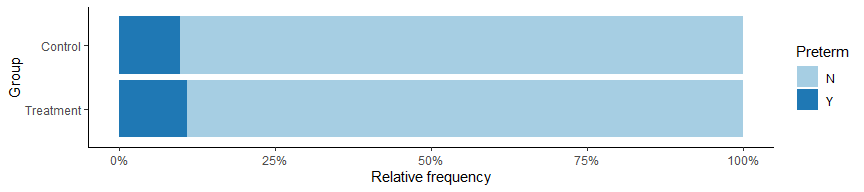

M10 Data Analysis: Putting it together
================
Matthew Ragoza
12/16/2021

-   [Treatment group and preterm
    birth](#treatment-group-and-preterm-birth)
-   [Age and preterm birth](#age-and-preterm-birth)
-   [Age and infant birthweight](#age-and-infant-birthweight)

# Treatment group and preterm birth

We will first investigate the relationship between treatment group and
preterm birth. These are two categorical variables with two levels each,
so we can summarize them numerically using the two-way frequency table
shown in Table 1. Out of the 793 participants who did not have a missing
value for preterm birth, 391 were in the control group and 402 were in
the treatment group, and 711 did not have a preterm birth while 82 did.
Of the 391 control subjects, 38 (9.7%) had a preterm birth, while 44
(10.9%) of the 402 treatment group subjects had a preterm birth. We can
visually assess this difference in relative frequency of preterm births
between the groups using the stacked bar plot in Figure 1. There is a
slight difference in the proportion of each group in the sample that had
preterm birth which can be seen in the plot.

``` r
agg <- opt %>%
    drop_na(Preterm) %>%
    group_by(Group, Preterm) %>%
    summarize(count=n(), .groups='drop') %>%
    spread(key=Preterm, value=count) %>%
    mutate(Total=N+Y) %>%
    adorn_totals() %>%
    mutate(
        Pct_N=N/Total*100,
        Pct_Y=Y/Total*100,
    ) %>%
    mutate(Pct_Total=Pct_N+Pct_Y) %>%
    mutate_if(is.numeric, round, digits=1)
    
agg %>%
    kable(col.names=c(
        'Group',
        'Preterm=N',
        'Preterm=Y',
        'Total',
        'Preterm=N (%)',
        'Preterm=Y (%)',
        'Total (%)'
    )) %>%
    kable_styling()
```

<table class="table" style="margin-left: auto; margin-right: auto;">
<thead>
<tr>
<th style="text-align:left;">
Group
</th>
<th style="text-align:right;">
Preterm=N
</th>
<th style="text-align:right;">
Preterm=Y
</th>
<th style="text-align:right;">
Total
</th>
<th style="text-align:right;">
Preterm=N (%)
</th>
<th style="text-align:right;">
Preterm=Y (%)
</th>
<th style="text-align:right;">
Total (%)
</th>
</tr>
</thead>
<tbody>
<tr>
<td style="text-align:left;">
Control
</td>
<td style="text-align:right;">
353
</td>
<td style="text-align:right;">
38
</td>
<td style="text-align:right;">
391
</td>
<td style="text-align:right;">
90.3
</td>
<td style="text-align:right;">
9.7
</td>
<td style="text-align:right;">
100
</td>
</tr>
<tr>
<td style="text-align:left;">
Treatment
</td>
<td style="text-align:right;">
358
</td>
<td style="text-align:right;">
44
</td>
<td style="text-align:right;">
402
</td>
<td style="text-align:right;">
89.1
</td>
<td style="text-align:right;">
10.9
</td>
<td style="text-align:right;">
100
</td>
</tr>
<tr>
<td style="text-align:left;">
Total
</td>
<td style="text-align:right;">
711
</td>
<td style="text-align:right;">
82
</td>
<td style="text-align:right;">
793
</td>
<td style="text-align:right;">
89.7
</td>
<td style="text-align:right;">
10.3
</td>
<td style="text-align:right;">
100
</td>
</tr>
</tbody>
</table>

**Table 1.** Two-way frequency table for treatment group and preterm
birth. The table has been extended with the relative frequencies of
preterm births within each treatment group.

``` r
opt %>%
    drop_na(Preterm) %>%
    mutate(Group=factor(Group, levels=c('Treatment', 'Control'))) %>%
    group_by(Group, Preterm) %>%
    summarize(count=n(), .groups='drop') %>%
    ggplot(aes(
        x=count,
        y=Group,
        fill=Preterm
    )) +
    geom_bar(stat='identity', position='fill') +
    xlab('Relative frequency') +
    ylab('Group') +
    theme_classic() + 
    scale_x_continuous(labels=percent_format()) +
    scale_fill_brewer(palette='Paired')
```

<!-- -->

**Figure 1.** Stacked bar plot of relative frequency of preterm births
within each treatment group.

We would like to test whether there is a difference in the proportion of
preterm births between the treatment and control group. The null
hypothesis is that there is no difference in the proportion of preterm
births between the groups, while the alternative hypothesis is that
there is a nonzero difference in the proportion of preterm births
between the groups. The most appropriate procedure to test these
hypotheses is a two-sample Z test of the proportions. We can assume the
study was designed using simple random samples for the treatment groups
and the participants in each group were independently sampled.
Furthermore, we can see from Table 1 that there are at least 5 subjects
in each cell of the two-way table. Therefore, the conditions for running
the Z test are satisfied, so we will now perform it at a significance
level of 0.05.

``` r
alpha = 0.05
mat <- select(head(agg, n=2), c('Y', 'Total'))
prop.test(x=mat$Y, n=mat$Total, alternative='two.sided', correct=FALSE)
```

    ## 
    ##  2-sample test for equality of proportions without continuity
    ##  correction
    ## 
    ## data:  mat$Y out of mat$Total
    ## X-squared = 0.32166, df = 1, p-value = 0.5706
    ## alternative hypothesis: two.sided
    ## 95 percent confidence interval:
    ##  -0.05461543  0.03008336
    ## sample estimates:
    ##    prop 1    prop 2 
    ## 0.0971867 0.1094527

``` r
# get critical value
z_crit <- qnorm(1-alpha/2)
cat(sprintf('critical value = %f\n', z_crit))
```

    ## critical value = 1.959964

``` r
# compute odds ratio
mat$Pr_Y <- mat$Y / mat$Total
mat$Odds_Y <- mat$Pr_Y / (1 - mat$Pr_Y)
or <- mat$Odds_Y[2] / mat$Odds_Y[1]
cat(sprintf('odds ratio = %f', or))
```

    ## odds ratio = 1.141723

The test statistic of 0.32 indicates that the observed difference in
proportions of preterm births between the groups is 0.32 standard errors
from the null hypothesis value of 0. The p-value 0.571 implies that we
would have a 57.1% chance of seeing a test statistic this extreme if the
null hypothesis were true. At our chosen significance level of 5%, we do
not have sufficient evidence to reject the null hypothesis. Therefore,
we do not have enough evidence to conclude that there is a difference in
the proportion of preterm births between the treatment and control
group. We are 95% confident that the true difference in population
proportions of preterm births between the groups is in the range -0.05
and 0.03. This interval contains the null hypothesis value of 0, which
agrees with our result from the hypothesis test. The odds ratio of 1.14
means that individuals in the treatment group had 1.14 higher odds of
having a preterm birth than those in the control group.

# Age and preterm birth

The next research question is about the effect of the age of the
pregnant individual on preterm birth rates. Age is a continuous variable
and preterm birth is a categorical variable, so we can numerically
summarize their relationship using measures of center and spread grouped
by preterm birth, seen in Table 2. The mean age of individuals who had
preterm births was 27.5, compared to 25.8 for those who did not. The
standard deviation of age was 6.1 for those who had preterm births and
5.5 for those who did not. The maximum age was 44 for both preterm and
non-preterm births, while the minimum age was 18 for preterm births and
16 for non-preterm births. The age distributions of the two categories
can be visually compared using the side-by-side box plots in Figure 2.
The age distribution in the preterm birth group appears to be shifted
sligtly higher than the non-preterm group.

``` r
opt %>%
    drop_na(Preterm) %>%
    group_by(Preterm) %>%
    mutate(value=Age) %>%
    summarise(
        n=n(),
        mean=mean(value),
        SD=sd(value),
        Q1=quantile(value, 0.25),
        Q2=quantile(value, 0.50),
        Q3=quantile(value, 0.75),
        IQR=quantile(value, 0.75)-quantile(value, 0.25),
        min=min(value),
        max=max(value),
        range=max(value)-min(value)
    ) %>%
    mutate_if(is.numeric, round, digits=1) %>%
    kable() %>%
    kable_styling()
```

<table class="table" style="margin-left: auto; margin-right: auto;">
<thead>
<tr>
<th style="text-align:left;">
Preterm
</th>
<th style="text-align:right;">
n
</th>
<th style="text-align:right;">
mean
</th>
<th style="text-align:right;">
SD
</th>
<th style="text-align:right;">
Q1
</th>
<th style="text-align:right;">
Q2
</th>
<th style="text-align:right;">
Q3
</th>
<th style="text-align:right;">
IQR
</th>
<th style="text-align:right;">
min
</th>
<th style="text-align:right;">
max
</th>
<th style="text-align:right;">
range
</th>
</tr>
</thead>
<tbody>
<tr>
<td style="text-align:left;">
N
</td>
<td style="text-align:right;">
711
</td>
<td style="text-align:right;">
25.8
</td>
<td style="text-align:right;">
5.5
</td>
<td style="text-align:right;">
22
</td>
<td style="text-align:right;">
25
</td>
<td style="text-align:right;">
29.5
</td>
<td style="text-align:right;">
7.5
</td>
<td style="text-align:right;">
16
</td>
<td style="text-align:right;">
44
</td>
<td style="text-align:right;">
28
</td>
</tr>
<tr>
<td style="text-align:left;">
Y
</td>
<td style="text-align:right;">
82
</td>
<td style="text-align:right;">
27.5
</td>
<td style="text-align:right;">
6.1
</td>
<td style="text-align:right;">
23
</td>
<td style="text-align:right;">
27
</td>
<td style="text-align:right;">
31.8
</td>
<td style="text-align:right;">
8.8
</td>
<td style="text-align:right;">
18
</td>
<td style="text-align:right;">
44
</td>
<td style="text-align:right;">
26
</td>
</tr>
</tbody>
</table>

**Table 2.** Measures of center and spread for patient age grouped by
preterm birth.

``` r
opt %>%
    drop_na(Preterm) %>%
    #mutate(Group=factor(Group, levels=c('Treatment', 'Control'))) %>%
    ggplot(aes(
        x=Age,
        y=Preterm
    )) +
    geom_boxplot() +
    xlab('Age') +
    ylab('Preterm') +
    theme_classic()
```

<!-- -->

**Figure 2.** Side-by-side box plots of patient age grouped by preterm
birth.

We would like to test whether there is a difference in the mean age of
individuals who had a preterm birth compared to those who did not. The
null hypothesis is that there is no difference in the mean age of the
groups. The alternative hypothesis is that there is a nonzero difference
in the mean age of subjects who had preterm births compared to those who
had non-preterm births. Since the patient groups are independent, the
most appropriate test would be a two-sample t test. The participants are
a simple random sample and there are greater than 30 in each category
(preterm vs. not preterm). We need to check if the variances of the
groups are equal to know which type of two-sample t test is appropriate.

We can run an F test for homogeneity of variance to compare the
population variance in age between preterm and non-preterm births. The
null hypothesis is that the ratio of the variances in age between the
groups is equal to 1, while the alternative hypothesis is that the
variance ratio is not equal to 1. The F test is not robust to small
sample sizes, but we can assume the age distribution is normally
distributed, so the requirements are satisfied for the test. We can now
run the test using a significance level of 0.05.

``` r
var.test(Age ~ Preterm, data=opt, alternative='two.sided')
```

    ## 
    ##  F test to compare two variances
    ## 
    ## data:  Age by Preterm
    ## F = 0.81234, num df = 710, denom df = 81, p-value = 0.1833
    ## alternative hypothesis: true ratio of variances is not equal to 1
    ## 95 percent confidence interval:
    ##  0.5733789 1.1025946
    ## sample estimates:
    ## ratio of variances 
    ##          0.8123418

The F statistic of 0.81 means that the observed variance in age of the
non-preterm births was 81.2% of the variance in age for preterm births.
The p-value implies that we would have an 18.3% chance of seeing a
variance ratio this extreme if the null hypothesis were true. At our
selected alpha of 5%, we do not reject the null hypothesis. We do not
have evidence that there is a difference in age variance between
individuals who had preterm vs. non-preterm births.

Since we did not find evidence of unequal variance, we can run a
two-sample t test on the difference in mean age of the groups using
equal variance. We have checked the assumptions and conditions of the
test, so we will proceed to run it at a significance level of 0.05.

``` r
t.test(Age ~ Preterm, data=opt, alternative='two.sided', var.equal=TRUE)
```

    ## 
    ##  Two Sample t-test
    ## 
    ## data:  Age by Preterm
    ## t = -2.6665, df = 791, p-value = 0.007821
    ## alternative hypothesis: true difference in means is not equal to 0
    ## 95 percent confidence interval:
    ##  -3.0014824 -0.4561348
    ## sample estimates:
    ## mean in group N mean in group Y 
    ##        25.81997        27.54878

``` r
# compute estimated difference in mean age
mat <- opt %>% group_by(Preterm) %>% summarise_at(vars(Age), mean)
diff <- mat$Age[2] - mat$Age[1]
cat(sprintf('difference in means = %f', diff))
```

    ## difference in means = 1.728809

The t statistic implies that the observed age difference is 2.67
standard errors below the null hypothesis value of 0. The p-value
indicates that we would have a 0.78% chance of seeing a t statistic at
least this extreme if the null hypothesis were true. Since we decided on
a significance level of 5%, we can reject the null hypothesis. We have
strong evidence that there is a difference in the mean age of
individuals who have preterm births compared to non-preterm births. We
are 95% confident that the true difference in mean age between these
groups is between -3 and -0.45 years, which does not include the null
hypothesis value of 0. Therefore, the confidence interval supports our
conclusion from the t test. The estimated difference in mean age is 1.73
years older for those who have preterm births.

# Age and infant birthweight

The final question that we want to answer is about the effect of age on
infant birthweight. Both of these variables are continuous, so we can
begin by analyzing them separately using measures of center and spread,
seen in Table 3. The mean age of the pregnant individual was 26 with a
standard deviation of 5.6. The mean infant birthweight was 3248.3 grams
with a standard deviation of 580 grams. We can visually assess the joint
distribution of age and infant birthweight using the scatter plot in
Figure 3. It does not appear that there is any relationship between the
infant birthweight and age by qualitative assessment of the scatter
plot.

``` r
opt %>%
    drop_na(Preterm) %>%
    select(c('Age', 'Birthweight')) %>%
    melt(value.name='value') %>%
    group_by(variable) %>%
    summarise(
        n=n(),
        mean=mean(value),
        SD=sd(value),
        Q1=quantile(value, 0.25),
        Q2=quantile(value, 0.50),
        Q3=quantile(value, 0.75),
        IQR=quantile(value, 0.75)-quantile(value, 0.25),
        min=min(value),
        max=max(value),
        range=max(value)-min(value)
    ) %>%
    mutate_if(is.numeric, round, digits=1) %>%
    kable() %>%
    kable_styling()
```

<table class="table" style="margin-left: auto; margin-right: auto;">
<thead>
<tr>
<th style="text-align:left;">
variable
</th>
<th style="text-align:right;">
n
</th>
<th style="text-align:right;">
mean
</th>
<th style="text-align:right;">
SD
</th>
<th style="text-align:right;">
Q1
</th>
<th style="text-align:right;">
Q2
</th>
<th style="text-align:right;">
Q3
</th>
<th style="text-align:right;">
IQR
</th>
<th style="text-align:right;">
min
</th>
<th style="text-align:right;">
max
</th>
<th style="text-align:right;">
range
</th>
</tr>
</thead>
<tbody>
<tr>
<td style="text-align:left;">
Age
</td>
<td style="text-align:right;">
793
</td>
<td style="text-align:right;">
26.0
</td>
<td style="text-align:right;">
5.6
</td>
<td style="text-align:right;">
22
</td>
<td style="text-align:right;">
25
</td>
<td style="text-align:right;">
30
</td>
<td style="text-align:right;">
8
</td>
<td style="text-align:right;">
16
</td>
<td style="text-align:right;">
44
</td>
<td style="text-align:right;">
28
</td>
</tr>
<tr>
<td style="text-align:left;">
Birthweight
</td>
<td style="text-align:right;">
793
</td>
<td style="text-align:right;">
3248.3
</td>
<td style="text-align:right;">
580.0
</td>
<td style="text-align:right;">
2985
</td>
<td style="text-align:right;">
3280
</td>
<td style="text-align:right;">
3580
</td>
<td style="text-align:right;">
595
</td>
<td style="text-align:right;">
450
</td>
<td style="text-align:right;">
5160
</td>
<td style="text-align:right;">
4710
</td>
</tr>
</tbody>
</table>

**Table 3.** Measures of center and spread for patient age and infant
birthweight in grams.

``` r
opt %>%
    drop_na(Preterm) %>%
    ggplot(aes(
        x=Age,
        y=Birthweight,
    )) +
    geom_point(alpha=0.125) +
    geom_smooth(method='lm') +
    xlab('Age') +
    ylab('Infant birthweight (g)') +
    theme_classic()
```

<!-- -->

**Figure 3.** Scatter plot of infant birthweight and age of patient. The
linear regression model and confidence interval are depicted as well.

We can investigate the relationship between age and infant birthweight
by fitting a linear regression model. We can assume that the
observational units in the sample are independent. We can guess from the
scatter plot that there is a linear relationship between the expected
infant birthweight and age, and that the variance in infant birthweight
is constant with respect to age. We will also assume that the
conditional distribution of infant birthweight given age follows a
normal distribution. Therefore the conditions are met to fit a linear
regression model, so we can proceed to do so.

``` r
alpha = 0.05
model <- lm(Birthweight ~ Age, data=opt)
summary(model)
```

    ## 
    ## Call:
    ## lm(formula = Birthweight ~ Age, data = opt)
    ## 
    ## Residuals:
    ##      Min       1Q   Median       3Q      Max 
    ## -2774.53  -269.33    29.43   344.19  1880.03 
    ## 
    ## Coefficients:
    ##             Estimate Std. Error t value Pr(>|t|)    
    ## (Intercept) 3145.327     98.188  32.034   <2e-16 ***
    ## Age            3.960      3.693   1.072    0.284    
    ## ---
    ## Signif. codes:  0 '***' 0.001 '**' 0.01 '*' 0.05 '.' 0.1 ' ' 1
    ## 
    ## Residual standard error: 579.9 on 791 degrees of freedom
    ##   (30 observations deleted due to missingness)
    ## Multiple R-squared:  0.001452,   Adjusted R-squared:  0.0001896 
    ## F-statistic:  1.15 on 1 and 791 DF,  p-value: 0.2838

``` r
confint(model, 'Age', level=0.95)
```

    ##         2.5 %   97.5 %
    ## Age -3.288311 11.20871

The intercept estimate means that the expected birthweight of an infant
from a patient with age 0 would be 3145.3 grams. The age coefficient can
be interpretted as saying that there is an increase in the infant
birthweight of 3.96 grams for each additional year in the age of the
pregnant individual. We are 95% confident that the true change in infant
birthweight for each added year in patient age is between -3.29 and 11.2
grams.

In order to test whether the regression model describes a significant
linear relationship between the age of the patient and the infant
birthweight, we can test the age coefficient (i.e. slope) in the model.
The null hypothesis is that there is no change in the expected infant
birthweight for each additional year in patient age. The alternative
hypothesis is that there is a non-zero change in the expected infant
birthweight for each additional year in the age of the patient. We will
test these hypotheses at a significance level of 0.05.

The test statistic for the age coefficient in the linear model is 1.07.
This implies that the slope of the fit line is 1.07 standard errors from
the null hypothesis value of 0. The p-value means that we would have a
28.4% probability of obtaining a coefficient this extreme if the null
hypothesis were true. At a significance level of 5%, we do not reject
the null hypothesis. We have insufficient evidence to conclude that
there is a linear relationship between the age of the patient and the
infant birthweight. The coefficient of determination indicates that
0.15% of the total variation in the infant birthweight is explained by
the patient’s age. This low value further suggests that there is no
correlation between age and infant birthweight.
