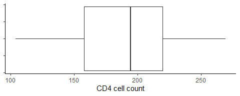
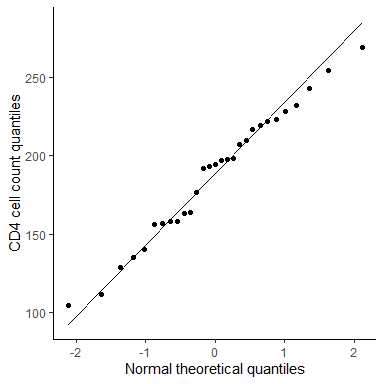

M4 Data Analysis: One-Sample Procedures
================
Matthew Ragoza
10/12/2021

-   [CD4 cell counts](#cd4-cell-counts)
-   [Lung cancer rate](#lung-cancer-rate)

# CD4 cell counts

The purpose of this analysis is to determine if the mean CD4 cell count
of HIV positive patients is less than 200 before they receive treatment.
The population consists of HIV patients prior to receiving medical
treatment, while the sample is a set of 29 HIV-positive patients from
this population, who also have not received treatment.

The distribution of CD4 cell count in this sample can be seen in Figure
1 and has been summarized numerically in Table 1. The cell count is a
quantitative variable, so it has been displayed as a box plot, and
summarized using measures of center and spread. The sample mean of 188.1
is less than the sample median of 194.6, indicating a left-skewed
distribution.

``` r
load('cd4.RData')
ggplot(cd4 %>%
    drop_na(cd4),
    aes(x=cd4)
) + geom_boxplot() + theme_classic() + theme(axis.text.y=element_blank()) + xlab('CD4 cell count')
```

<!-- -->

**Figure 1.** Visualization of CD4 cell count distribution.

``` r
cd4 %>% 
summarize(
    N=n(),
    Mean=mean(cd4, na.rm=TRUE),
    SD=sd(cd4, na.rm=TRUE),
    Q1=quantile(cd4, 0.25, na.rm=TRUE),
    Median=median(cd4, na.rm=TRUE),
    Q3=quantile(cd4, 0.75, na.rm=TRUE),
    IQR=quantile(cd4, 0.75, na.rm=TRUE)-quantile(cd4, 0.25, na.rm=TRUE),
    Min=min(cd4, na.rm=TRUE),
    Max=max(cd4, na.rm=TRUE),
    Range=max(cd4, na.rm=TRUE)-min(cd4, na.rm=TRUE),
) %>%
format(digits=4) %>%
kable() %>%
kable_styling()
```

<table class="table" style="margin-left: auto; margin-right: auto;">
<thead>
<tr>
<th style="text-align:left;">
N
</th>
<th style="text-align:left;">
Mean
</th>
<th style="text-align:left;">
SD
</th>
<th style="text-align:left;">
Q1
</th>
<th style="text-align:left;">
Median
</th>
<th style="text-align:left;">
Q3
</th>
<th style="text-align:left;">
IQR
</th>
<th style="text-align:left;">
Min
</th>
<th style="text-align:left;">
Max
</th>
<th style="text-align:left;">
Range
</th>
</tr>
</thead>
<tbody>
<tr>
<td style="text-align:left;">
29
</td>
<td style="text-align:left;">
188.1
</td>
<td style="text-align:left;">
42.13
</td>
<td style="text-align:left;">
158.1
</td>
<td style="text-align:left;">
194.6
</td>
<td style="text-align:left;">
219.6
</td>
<td style="text-align:left;">
61.51
</td>
<td style="text-align:left;">
104.2
</td>
<td style="text-align:left;">
269.4
</td>
<td style="text-align:left;">
165.1
</td>
</tr>
</tbody>
</table>

**Table 1.** Numerical summary of CD4 cell count distribution.

Based on this sample, we want to know if the population mean CD4 cell
count of pre-treatment HIV patients is significantly lower than 200.
Therefore, the null hypothesis is that the population mean CD4 cell
count is 200, and the alternative hypothesis is that the population mean
CD4 cell count is less than 200.

To test this hypothesis, we first need to decide an appropriate
hypothesis test to use. We have a simple random sample, but our sample
size is only 29, which is just below the rule of thumb value of 30.
However, if CD4 cell counts are normally distributed in the population,
then it is still acceptable to apply a t-test. We can check this by
using the normal quantile plot in Figure 2 to see if CD4 cell counts in
the sample are approximately normal. Since the CD4 cell count quantiles
in the sample are very close to the identity line when plotted against
the quantiles of a theoretical normal distribution, the sample is
approximately normally distributed. Therefore, the requirements are
satisfied to apply a t-test.

``` r
ggplot(cd4,
    aes(sample=cd4)
) + geom_qq() + geom_qq_line() + theme_classic() + ylab('CD4 cell count quantiles') + xlab('Normal theoretical quantiles')
```

<!-- -->

**Figure 2.** Normal quantile plot of CD4 cell count to determine
normality.

Before proceeding, we will decide on a significance level of 0.05. We
will now run the t-test.

``` r
alpha = 0.05
t.test(x=cd4, mu=200, alternative='less')
```

    ## 
    ##  One Sample t-test
    ## 
    ## data:  cd4
    ## t = -1.5208, df = 28, p-value = 0.06976
    ## alternative hypothesis: true mean is less than 200
    ## 95 percent confidence interval:
    ##      -Inf 201.4106
    ## sample estimates:
    ## mean of x 
    ##  188.1027

The test statistic indicates that the observed sample mean is -1.521
standard errors from the null hypothesis value of CD4 cell count. The
p-value indicates that we would have a 6.98% probability of observing a
sample mean at least as extreme as this if the null hypothesis were
true.

Since we previously set the significance level to 0.05, the p-value of
0.0698 is greater than the required significance level. Therefore, we
fail to reject the null hypothesis, as there is insufficient evidence to
support that the population mean CD4 cell count of HIV patients is less
than 200 prior to treatment.

``` r
n = nrow(cd4)
xbar = mean(cd4$cd4)
s = sd(cd4$cd4)
moe <- qt(1-alpha, df=n-1)*s/sqrt(n)
c(xbar-moe, xbar+moe)
```

    ## [1] 174.7949 201.4106

The 90% confidence interval for the population mean of CD4 cell count is
\[174.8, 201.4\]. This indicates that if we were to take repeated
samples from the population and construct confidence intervals like
this, 90% of the time they would capture the true population mean. In
context of the study, there is a 90% probability that the CD4 cell count
range from 174.8 to 201.4 contains the true population mean for
pre-treatment HIV patients. This interval contains the hypothesized
value of 200, so it agrees with the result of the hypothesis test.

``` r
delta = 10
s = sd(cd4$cd4)
get_power_n <- function(power) {
    ceiling(power.t.test(power=power, delta=delta, sd=s)$n)
}
df <- data.frame(power=c(0.5,0.6,0.7,0.8,0.9))
df$n <- sapply(df$power, FUN=get_power_n)
kable(df) %>% kable_styling()
```

<table class="table" style="margin-left: auto; margin-right: auto;">
<thead>
<tr>
<th style="text-align:right;">
power
</th>
<th style="text-align:right;">
n
</th>
</tr>
</thead>
<tbody>
<tr>
<td style="text-align:right;">
0.5
</td>
<td style="text-align:right;">
138
</td>
</tr>
<tr>
<td style="text-align:right;">
0.6
</td>
<td style="text-align:right;">
175
</td>
</tr>
<tr>
<td style="text-align:right;">
0.7
</td>
<td style="text-align:right;">
221
</td>
</tr>
<tr>
<td style="text-align:right;">
0.8
</td>
<td style="text-align:right;">
280
</td>
</tr>
<tr>
<td style="text-align:right;">
0.9
</td>
<td style="text-align:right;">
374
</td>
</tr>
</tbody>
</table>

**Table 2.** Sample sizes required for a given power in the follow-up
study.

If the researchers would like to detect a difference in CD4 cell counts
of 10 in their follow-up study, Table 2 shows the sample sizes that
would be required for different powers. Power is the probability of
correctly rejecting a false null hypothesis, and is generally desired to
be at least 80%. Therefore, the researchers should try to obtain a
sample size of at least 280 participants for their follow-up study to
achieve a power of 80%.

# Lung cancer rate

Next we analyze the proportion of deaths that are due to lung cancer
among workers in a chemical plant. The population was men aged 15-64 in
England and Wales who died between 1970-1972, and the population
proportion of deaths due to lung cancer was 12%. The sample was a group
of 40 men in this group who worked for at least one year in a chemical
plant by the time they died. Of those 40 deaths among chemical plant
workers, 10 were due to lung cancer, which is a sample proportion of
25%.

``` r
n = 40
x = 10
p0 = 0.12
```

We would like to determine if the proportion of deaths due to lung
cancer was significantly higher among former chemical plant workers than
the broader population proportion. Therefore, the null hypothesis is
that the proportion of lung cancer deaths among chemical plant workers
was the same as the population proportion of 12%. The alternative
hypothesis is that the proportion of lung cancer deaths in chemical
plant workers is greater than 12%.

To determine the appropriate hypothesis test to apply, we first have to
check the requirements. We have a simple random sample, however we do
not have the requirement that that we would expect at least five
successes in the sample under the null hypothesis (n\*p0 = 4.8), as seen
below. Therefore, we will use an exact binomial test instead of a
z-test.

``` r
c(n*p0, n*(1-p0))
```

    ## [1]  4.8 35.2

Again, we will use a significance level of 0.05. We can now run the
test.

``` r
alpha = 0.05
binom.test(x, n, p0, alternative='greater')
```

    ## 
    ##  Exact binomial test
    ## 
    ## data:  x and n
    ## number of successes = 10, number of trials = 40, p-value = 0.01749
    ## alternative hypothesis: true probability of success is greater than 0.12
    ## 95 percent confidence interval:
    ##  0.1423699 1.0000000
    ## sample estimates:
    ## probability of success 
    ##                   0.25

Since a binomial test was run instead of a z-test, there is no test
statistic to interpret. However, the p-value indicates that we have a
1.75% chance of observing a sample proportion of deaths due to lung
cancer at least as extreme as this, assuming that the null hypothesis is
true.

The p-value of 0.0175 is less than the significance level of 0.05, so we
reject the null hypothesis. Therefore, this is evidence that the
population proportion of lung cancer deaths among chemical plant workers
is significantly greater than the 12% rate of the general population.

``` r
BinomCI(x, n, conf.level=0.90, method='clopper-pearson')
```

    ##       est    lwr.ci    upr.ci
    ## [1,] 0.25 0.1423699 0.3870602

The 90% confidence interval for the population proportion of deaths due
to lung cancer is \[14.2%, 38.7%\]. This indicates that if we were to
take repeated samples from the population and construct confidence
intervals like this, 90% of the time they would capture the true
population proportion. In context of the study, there is a 90%
probability that the interval from 14.2% to 38.7% contains the true
population proportion of deaths due to lung cancer among former chemical
plant workers in this demographic. This interval does not contain the
general population proportion of 12%, so it agrees with the result of
the hypothesis test.
