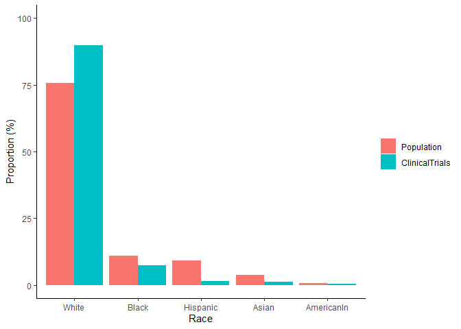
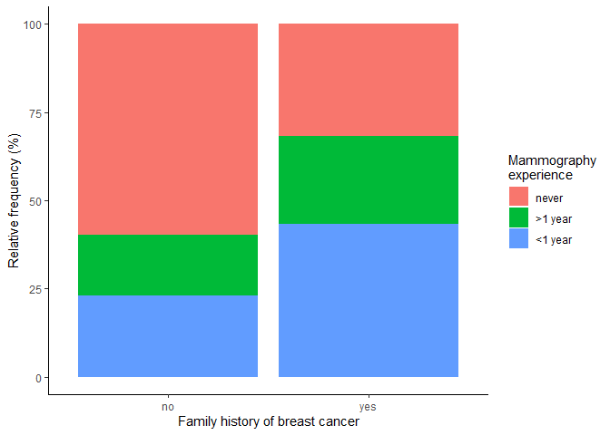

M5 Data Analysis: Contingency Tables
================
Matthew Ragoza
10/19/2021

-   [Representation in Research](#representation-in-research)
-   [Mammography](#mammography)
-   [Hip Protectors](#hip-protectors)

# Representation in Research

We are interested in investigating racial representation in clinical
trials to determine if it matches the racial makeup of the broader
population. A numerical summary of the distributions of race in the
population and in a sample of lung cancer clinical trial participants is
shown in Table 1. This information is also shown as side-by-side bar
plots in Figure 1 to facilitate comparison of the racial breakdown of
the population and the clinical trial sample.

``` r
load('LungCancer.RData')

agg <- lungcancer %>%
    group_by(race) %>%
    summarize(count=n()) %>%
    mutate(ClinicalTrials=round(100*count/sum(count), digits=2)) %>%
    arrange(-count)

agg$Population <- c(75.6, 10.8, 9.1, 3.8, 0.7)
agg$expected <- round(agg$Population/100 * sum(agg$count), 0)

agg %>%
    adorn_totals() %>%
    kable(col.names=c(
        'Race',
        'Clinical trial count',
        'Clinical trial proportion (%)',
        'Population proportion (%)',
        'Population-representative count'
    )) %>%
    kable_styling()
```

<table class="table" style="margin-left: auto; margin-right: auto;">
<thead>
<tr>
<th style="text-align:left;">
Race
</th>
<th style="text-align:right;">
Clinical trial count
</th>
<th style="text-align:right;">
Clinical trial proportion (%)
</th>
<th style="text-align:right;">
Population proportion (%)
</th>
<th style="text-align:right;">
Population-representative count
</th>
</tr>
</thead>
<tbody>
<tr>
<td style="text-align:left;">
White
</td>
<td style="text-align:right;">
3855
</td>
<td style="text-align:right;">
89.71
</td>
<td style="text-align:right;">
75.6
</td>
<td style="text-align:right;">
3249
</td>
</tr>
<tr>
<td style="text-align:left;">
Black
</td>
<td style="text-align:right;">
316
</td>
<td style="text-align:right;">
7.35
</td>
<td style="text-align:right;">
10.8
</td>
<td style="text-align:right;">
464
</td>
</tr>
<tr>
<td style="text-align:left;">
Hispanic
</td>
<td style="text-align:right;">
60
</td>
<td style="text-align:right;">
1.40
</td>
<td style="text-align:right;">
9.1
</td>
<td style="text-align:right;">
391
</td>
</tr>
<tr>
<td style="text-align:left;">
Asian
</td>
<td style="text-align:right;">
54
</td>
<td style="text-align:right;">
1.26
</td>
<td style="text-align:right;">
3.8
</td>
<td style="text-align:right;">
163
</td>
</tr>
<tr>
<td style="text-align:left;">
AmericanIn
</td>
<td style="text-align:right;">
12
</td>
<td style="text-align:right;">
0.28
</td>
<td style="text-align:right;">
0.7
</td>
<td style="text-align:right;">
30
</td>
</tr>
<tr>
<td style="text-align:left;">
Total
</td>
<td style="text-align:right;">
4297
</td>
<td style="text-align:right;">
100.00
</td>
<td style="text-align:right;">
100.0
</td>
<td style="text-align:right;">
4297
</td>
</tr>
</tbody>
</table>

**Table 1.** Numerical summary of race distribution in overall
population and in lung cancer clinical trials.

``` r
agg %>%
    gather('key', 'value', ClinicalTrials, Population) %>%
    ggplot(aes(
        x=factor(race, levels=agg$race), 
        y=value,
        fill=factor(key, levels=c('Population', 'ClinicalTrials'))
    )) +
    geom_bar(position='dodge', stat='identity') +
    xlab('Race') +
    ylab('Proportion (%)') +
    ylim(0, 100) +
    theme_classic() +
    theme(legend.title=element_blank())
```

<!-- -->

**Figure 1.** Visualization of race distribution in overall population
compared to lung cancer clinical trials.

Visual assessment of Figure 1 suggests that there are differences in the
racial distribution of clinical trials compared to the general
population. We can state this formally in order to enable a hypothesis
test: the null hypothesis is that the proportions of each racial group
in lung cancer clinical trials are the same as their population
proportions. The alternative hypothesis is that at least one racial
group has a different proportion in clinical trials compared to their
population proportion.

To test this hypothesis, a chi-squared goodness-of-fit test is
appropriate. Chi-squared goodness-of-fit tests can detect whether
frequencies of a categorical variable with more than two categories
(race) are different in a sample (clinical trial participants) compared
to a theoretical distribution (the general population). The participants
in the clinical trials were likely determined by simple random sampling.
Furthermore, at least five clinical trial participants of each race
would be expected under the null hypothesis, as seen in the last column
of Table 1. Therefore, the requirements are satisfied to apply a
chi-squared test, which will now be performed using a significance level
of 0.01.

``` r
alpha = 0.01
k = nrow(agg)
chisq.test(x=agg$count, p=agg$Population/100)
```

    ## 
    ##  Chi-squared test for given probabilities
    ## 
    ## data:  agg$count
    ## X-squared = 524.71, df = 4, p-value < 2.2e-16

``` r
qchisq(df=k-1, p=1-alpha) # the critical value
```

    ## [1] 13.2767

The chi-squared test statistic provides a measure of statistical
distance between the racial distribution in clinical trials compared to
the general population. Since the critical value is 13.28 for the chosen
significance level of 0.01, we would expect to see chi-squared test
statistics greater than 13.28 only 1% of the time if the null hypothesis
were true. The observed chi-squared test statistic is 524.71, which is
40 times larger than the critical value. The p-value of 2.2e-16
indicates that we would almost never observe a test statistic this large
if the null hypothesis were true. We can reject the null hypothesis
because the p-value is less than the significance level. In conclusion,
we have very strong evidence that the racial distribution in lung cancer
clinical trials is different from the racial makeup of the general
population.

# Mammography

The next question that we will investigate is whether there is a
relationship between mammography experience and family history of breast
cancer. A two-way table summarizing the relationship between these
variables numerically is shown in Table 2. The relationship is shown
graphically as stacked bar plots of relative frequencies in Figure 2.

``` r
load('mamexp.RData')

agg <- mamexp %>%
    group_by(famhist, me) %>%
    count() %>%
    spread(key=famhist, value=n) %>%
    adorn_totals(where=c('row', 'col'))

agg %>%
    kable(col.names=c(
        'Mammography experience',
        'No family history of breast cancer',
        'Family history of breast cancer',
        'Total'
    )) %>%
    kable_styling()
```

<table class="table" style="margin-left: auto; margin-right: auto;">
<thead>
<tr>
<th style="text-align:left;">
Mammography experience
</th>
<th style="text-align:right;">
No family history of breast cancer
</th>
<th style="text-align:right;">
Family history of breast cancer
</th>
<th style="text-align:right;">
Total
</th>
</tr>
</thead>
<tbody>
<tr>
<td style="text-align:left;">
never
</td>
<td style="text-align:right;">
220
</td>
<td style="text-align:right;">
14
</td>
<td style="text-align:right;">
234
</td>
</tr>
<tr>
<td style="text-align:left;">
\>1 year
</td>
<td style="text-align:right;">
63
</td>
<td style="text-align:right;">
11
</td>
<td style="text-align:right;">
74
</td>
</tr>
<tr>
<td style="text-align:left;">
\<1 year
</td>
<td style="text-align:right;">
85
</td>
<td style="text-align:right;">
19
</td>
<td style="text-align:right;">
104
</td>
</tr>
<tr>
<td style="text-align:left;">
Total
</td>
<td style="text-align:right;">
368
</td>
<td style="text-align:right;">
44
</td>
<td style="text-align:right;">
412
</td>
</tr>
</tbody>
</table>

**Table 2.** Two-way table of counts summarizing relationship between
mammography experience and family history of breast cancer.

``` r
mamexp %>%
    group_by(famhist, me) %>%
    summarise(count=n()) %>%
    mutate(freq=100*count/sum(count)) %>%
    ggplot(aes(
        x=famhist, 
        y=freq,
        fill=me
    )) +
    geom_bar(position='stack', stat='identity') +
    xlab('Family history of breast cancer') +
    ylab('Relative frequency (%)') +
    labs(fill='Mammography\nexperience') +
    theme_classic() +
    theme()
```

<!-- -->

**Figure 2.** Visualization of relationship between mammography
experience and family history of breast cancer.

Based on Figure 2, there appear to be differences in frequency of
mammography experience between the women in the sample with a family
history of breast cancer and those without. We can test this
statistically by first defining the hypotheses. The null hypothesis is
that mammography experience is independent of family history of breast
cancer. The alternative hypothesis is that mammography experience
depends on the history of breast cancer in the participant’s family.

To test this hypothesis, we can apply a chi-squared test of
independence. Chi-squared tests of independence can determine if there
is an association between two categorical variables, and are appropriate
when the variables are two measurements from the same observational
units. In this study, the variables are two different answers provided
by participants on a questionnaire, so they come from the same
observational units.

``` r
N = last(agg$Total)
N_no = last(agg$no)
N_yes = last(agg$yes)
agg %>%
    mutate(
        no_expected=round(Total*N_no/N, 2),
        yes_expected=round(Total*N_yes/N, 2)
    ) %>%
    select(c('me', 'no_expected', 'yes_expected', 'Total')) %>%
    kable(col.names=c(
        'Mammography experience',
        'No family history of breast cancer',
        'Family history of breast cancer',
        'Total'
    )) %>%
    kable_styling()
```

<table class="table" style="margin-left: auto; margin-right: auto;">
<thead>
<tr>
<th style="text-align:left;">
Mammography experience
</th>
<th style="text-align:right;">
No family history of breast cancer
</th>
<th style="text-align:right;">
Family history of breast cancer
</th>
<th style="text-align:right;">
Total
</th>
</tr>
</thead>
<tbody>
<tr>
<td style="text-align:left;">
never
</td>
<td style="text-align:right;">
209.01
</td>
<td style="text-align:right;">
24.99
</td>
<td style="text-align:right;">
234
</td>
</tr>
<tr>
<td style="text-align:left;">
\>1 year
</td>
<td style="text-align:right;">
66.10
</td>
<td style="text-align:right;">
7.90
</td>
<td style="text-align:right;">
74
</td>
</tr>
<tr>
<td style="text-align:left;">
\<1 year
</td>
<td style="text-align:right;">
92.89
</td>
<td style="text-align:right;">
11.11
</td>
<td style="text-align:right;">
104
</td>
</tr>
<tr>
<td style="text-align:left;">
Total
</td>
<td style="text-align:right;">
368.00
</td>
<td style="text-align:right;">
44.00
</td>
<td style="text-align:right;">
412
</td>
</tr>
</tbody>
</table>

**Table 3.** Two-way table showing expected counts assuming that
mammography experience and family history of breast cancer are
independent.

The design of this study probably involved a random sample of
observational units (participants). Furthermore, it can be seen in Table
3 that every cell in the two-way table has a least 5 counts, assuming
the null hypothesis is true. Therefore, the requirements are satisfied
to apply a chi-squared test of independence, which we will now perform
with significance level 0.10.

``` r
alpha = 0.10
r = length(unique(mamexp$me))
c = length(unique(mamexp$famhist))
chisq.test(x=table(mamexp$me, mamexp$famhist), correct=FALSE)
```

    ## 
    ##  Pearson's Chi-squared test
    ## 
    ## data:  table(mamexp$me, mamexp$famhist)
    ## X-squared = 13.05, df = 2, p-value = 0.001466

``` r
qchisq(df=(r-1)*(c-1), p=1-alpha) # the critical value
```

    ## [1] 4.60517

In this context, the chi-squared test statistic measures the disparity
between the observed joint distribution and what would be expected if
mammogram experience and family history of breast cancer were
independent. At the significance level of 0.01, the critical value of
4.61 means that we would have a 10% probability of seeing test
statistics greater than 4.61 if the variables were independent. The
observed chi-squared test statistic is 13.05, which is larger than the
critical value. Furthermore, the p-value of 0.0015 indicates that we
would have a 0.15% chance of seeing a test statistic this large if the
null hypothesis were true. Since the p-value is less than the
significance level, we can reject the null hypothesis. In conclusion, we
have strong evidence that mammography experience is dependent on family
history of breast cancer.

``` r
p_me_fh = (11+19)/44                    # P(mam_exp|fam_hist)
p_me_nfh = (63+85)/368                  # P(mam_exp|~fam_hist)
odds_me_fh = p_me_fh / (1 - p_me_fh)    # Odds(mam_exp|fam_hist)
odds_me_nfh = p_me_nfh / (1 - p_me_nfh) # Odds(mam_exp|~fam_hist)
odds_me_fh / odds_me_nfh                # odds ratio
```

    ## [1] 3.185328

The odds ratio of mammography experience for women with and without a
family history of breast cancer is 3.19. This can be interpreted by
saying that women with a family history of breast cancer have 3.19
higher odds of having had a mammogram than women with no family history
of breast cancer.

# Hip Protectors

The third analysis is related to the effectiveness of hip protectors in
preventing hip fractures in the elderly. The observational units of the
study were nursing home residents who each wore a hip protector on one
hip, and the variables that were measured were whether they had a hip
fracture on either the protected or unprotected hip.

We want to know from this data whether there was a difference in the
rate of fractures between the protected and unprotected hips. Since the
values of the two variables come from the same person, they are
dependent. Therefore we treat them as paired observations, and focus on
the discordant pairs. Specifically, the null hypothesis is that there
was no difference between the proportion of individuals who had an
unprotected hip fracture, but not a protected hip fracture, and the
proportion who had a protected hip fracture, but not an unprotected hip
fracture. The alternative hypothesis is that the proportion who only an
unprotected hip fracture is different from the proportion that only had
a protected hip fracture.

``` r
hip <- matrix(c(309, 15, 10, 2), nrow=2)
hip
```

    ##      [,1] [,2]
    ## [1,]  309   10
    ## [2,]   15    2

Given that we have two dependent categorical variables, we can test the
effectiveness of the hip protectors by using McNemar’s test. This test
compares proportions between discordant pairs of values of two dependent
categorical variables. Since the study was a randomized controlled
trial, we have a simple random sample of participants. In addition, we
have the requirement that the total count of discordant pairs is at
least 10. Therefore we can now apply McNemar’s test, using a
significance level of 0.05.

``` r
alpha = 0.05
mcnemar.test(hip, correct=FALSE)
```

    ## 
    ##  McNemar's Chi-squared test
    ## 
    ## data:  hip
    ## McNemar's chi-squared = 1, df = 1, p-value = 0.3173

Here the chi-squared statistic of 1.0 represents the statistical
distance between the probability of only having a fracture in the
unprotected hip and the probability of only having a fracture in the
protected hip. The p-value of 0.317 indicates that we would have a 31.7%
chance of seeing a chi-squared test statistic this drastic if the null
hypothesis were true. Since the p-value is less than the significance
level of 0.05, we fail to reject the null hypothesis. There is
insufficient evidence to conclude that the hip protectors were effective
in preventing hip fractures in the elderly.
