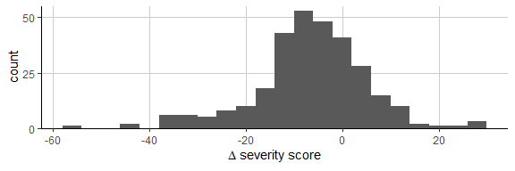
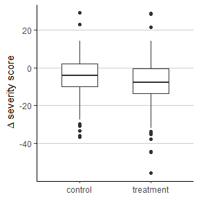

M6 Data Analysis: Two sample means
================
Matthew Ragoza
10/27/2021

-   [Change in headache severity](#change-in-headache-severity)
-   [Effect of acupuncture therapy](#effect-of-acupuncture-therapy)

# Change in headache severity

This data set was collected from a randomized controlled trial with the
goal of determining the effect of acupuncture therapy on headache
severity in patients with chronic headaches. We would first like to know
what the average difference in headache severity was from baseline to 1
year after baseline, regardless of treatment group. The difference in
headache severity score is summarized in Table 1. The reported headache
severity score changed by -6.49 on average by 1 year from the baseline
visit, with a standard deviation of 11.84. The median change in headache
severity was -6.25, which is higher than the mean. In addition, the
minimum change in headache severity of -55.75 was much more extreme than
the maximum of 29. These observations suggest that the distribution of
change in headache severity is left-skewed. This is confirmed by the
longer left tail of the histogram of change in headache severity score,
shown in Figure 1.

``` r
# get change in headache severity score
#   from baseline to 1 year
data$change = data$pk5 - data$pk1

data %>%
    drop_na(change) %>%
    summarise(
        n=n(),
        mean=mean(change),
        SD=sd(change),
        Q1=quantile(change, 0.25),
        Q2=quantile(change, 0.50),
        Q3=quantile(change, 0.75),
        IQR=quantile(change, 0.75) - quantile(change, 0.25),
        min=min(change),
        max=max(change),
        range=max(change)-min(change)
    ) %>%
    round(2) %>%
    kable() %>%
    kable_styling()
```

<table class="table" style="margin-left: auto; margin-right: auto;">
<thead>
<tr>
<th style="text-align:right;">
n
</th>
<th style="text-align:right;">
mean
</th>
<th style="text-align:right;">
SD
</th>
<th style="text-align:right;">
Q1
</th>
<th style="text-align:right;">
Q2
</th>
<th style="text-align:right;">
Q3
</th>
<th style="text-align:right;">
IQR
</th>
<th style="text-align:right;">
min
</th>
<th style="text-align:right;">
max
</th>
<th style="text-align:right;">
range
</th>
</tr>
</thead>
<tbody>
<tr>
<td style="text-align:right;">
301
</td>
<td style="text-align:right;">
-6.49
</td>
<td style="text-align:right;">
11.84
</td>
<td style="text-align:right;">
-11.75
</td>
<td style="text-align:right;">
-6.25
</td>
<td style="text-align:right;">
0.5
</td>
<td style="text-align:right;">
12.25
</td>
<td style="text-align:right;">
-55.75
</td>
<td style="text-align:right;">
29
</td>
<td style="text-align:right;">
84.75
</td>
</tr>
</tbody>
</table>

**Table 1.** Measures of center and spread for change in headache
severity score from baseline to 1 year.

``` r
data %>%
    ggplot(aes(
        x=change,
    )) +
    geom_histogram(na.rm=TRUE, binwidth=4) +
    xlab(expression(Delta*' severity score')) +
    scale_y_continuous(limit=c(0,55), expand=c(0,0), n.breaks=3) +
    theme_classic() +
    theme(
        panel.grid.major=element_line(color='grey80'),
    )
```

<!-- -->

**Figure 1.** Histogram of change in headache severity score from
baseline to 1 year.

It seems likely based on the distribution seen in Figure 1 that the mean
headache severity decreased at 1 year compared to the baseline, but we
can perform a test to evaluate this. The parameter we are interested in
is the population mean change in headache severity score. The null
hypothesis is that the population mean difference in headache severity
is zero, and the alternative hypothesis is that the population mean
difference in headache severity is less than zero.

Since we have two measurements from the same observational units
(patients at two different points in time), we know that the two samples
are dependent. Therefore, a paired t test is most appropriate. We can
assume that we have simple random samples since the data is from a
randomized controlled trial, and the sample size of 301 is much larger
than 30. Therefore, the conditions for running a paired t test are
satisfied. We can now perform the test using a significance level of
0.05.

``` r
alpha = 0.05
t.test(data$change, na.rm=TRUE, alternative='less')
```

    ## 
    ##  One Sample t-test
    ## 
    ## data:  data$change
    ## t = -9.5042, df = 300, p-value < 2.2e-16
    ## alternative hypothesis: true mean is less than 0
    ## 95 percent confidence interval:
    ##       -Inf -5.360427
    ## sample estimates:
    ## mean of x 
    ## -6.486489

``` r
cat(sprintf('critical value = %f', qt(p=alpha, df=300)))
```

    ## critical value = -1.649949

The t statistic indicates that the observed mean difference in headache
severity is -9.5 standard errors from the null hypothesis value of 0.0.
Given the significance level of 0.05, we would have a 5% chance of
seeing a t statistic less than the critical value of -1.65 if the null
hypothesis were true. The t statistic is much less than the critical
value, and the p-value of 2.2e-16 means that we would have a vanishingly
small probability of seeing a t statistic at least this low if the null
hypothesis were true. Therefore, we reject the null hypothesis. We can
interpret this as very strong evidence that the population mean headache
severity score decreased from baseline to 1 year. The 95% confidence
interval states that if we ran this experiment repeatedly, 95% of the
time the true population mean difference in headache severity would be
captured in the interval. Since the null hypothesis value of 0 is not
contained in the one-sided confidence interval of (-Inf, -5.36), this is
evidence that the headache severity score decreased from baseline to 1
year in the population.

# Effect of acupuncture therapy

Another question we are interested in is whether acupuncture therapy had
an effect on the change in headache severity. The treatment group in
this study underwent acupuncture therapy while the control group did
not. We can separately analyze numerical summaries of the change in
headache severity score for each group, which are shown in Table 2. The
headache severity score decreased by 4.37 on average for the control
group with a standard deviation of 10.4, and it decreased by 8.33 on
average for the treatment group with a standard deviation of 12.71. The
differences between the change in headache severity for the two groups
can be visually compared using the side-by-side box plots in Figure 2.

``` r
data %>%
    drop_na(change) %>%
    mutate(
        group=factor(group, labels=c('control', 'treatment'))
    ) %>%
    group_by(group) %>%
    summarise(
        n=n(),
        mean=mean(change),
        SD=sd(change),
        Q1=quantile(change, 0.25),
        Q2=quantile(change, 0.50),
        Q3=quantile(change, 0.75),
        IQR=quantile(change, 0.75) - quantile(change, 0.25),
        min=min(change),
        max=max(change),
        range=max(change) - min(change)
    ) %>%
    mutate_if(is.numeric, round, digits=2) %>%
    kable() %>%
    kable_styling()
```

<table class="table" style="margin-left: auto; margin-right: auto;">
<thead>
<tr>
<th style="text-align:left;">
group
</th>
<th style="text-align:right;">
n
</th>
<th style="text-align:right;">
mean
</th>
<th style="text-align:right;">
SD
</th>
<th style="text-align:right;">
Q1
</th>
<th style="text-align:right;">
Q2
</th>
<th style="text-align:right;">
Q3
</th>
<th style="text-align:right;">
IQR
</th>
<th style="text-align:right;">
min
</th>
<th style="text-align:right;">
max
</th>
<th style="text-align:right;">
range
</th>
</tr>
</thead>
<tbody>
<tr>
<td style="text-align:left;">
control
</td>
<td style="text-align:right;">
140
</td>
<td style="text-align:right;">
-4.37
</td>
<td style="text-align:right;">
10.40
</td>
<td style="text-align:right;">
-10.06
</td>
<td style="text-align:right;">
-4.00
</td>
<td style="text-align:right;">
2.0
</td>
<td style="text-align:right;">
12.06
</td>
<td style="text-align:right;">
-36.75
</td>
<td style="text-align:right;">
29.00
</td>
<td style="text-align:right;">
65.75
</td>
</tr>
<tr>
<td style="text-align:left;">
treatment
</td>
<td style="text-align:right;">
161
</td>
<td style="text-align:right;">
-8.33
</td>
<td style="text-align:right;">
12.71
</td>
<td style="text-align:right;">
-13.50
</td>
<td style="text-align:right;">
-7.75
</td>
<td style="text-align:right;">
-0.5
</td>
<td style="text-align:right;">
13.00
</td>
<td style="text-align:right;">
-55.75
</td>
<td style="text-align:right;">
28.73
</td>
<td style="text-align:right;">
84.48
</td>
</tr>
</tbody>
</table>

**Table 2.** Measures of center and spread for change in headache
severity score, split by treatment group.

``` r
data %>%
    ggplot(aes(
        x=factor(group), y=change
    )) +
    geom_boxplot(na.rm=TRUE, width=0.5) +
    xlab(NULL) +
    ylab(expression(Delta*' severity score')) +
    scale_x_discrete(
        labels=c('control', 'treatment')
    ) +
    theme_classic() +
    theme(
        panel.grid.major.y=element_line(color='grey80'),
    )
```

<!-- -->

**Figure 2.** Side-by-side box plots of change in headache severity
score for the treatment and control group.

Given the differences in shape of the box plots in Figure 2, it is
possible that there was a greater decrease in headache severity score
for the treatment group that received acupuncture therapy. Since the
measurements are from two independent samples, we could compare them
using a two-sample t test. However, this test is performed differently
depending on if the population variances are equal, so first we need to
determine whether the samples are from populations with unequal variance
before proceeding with the t test.

We can compare the variances of the two samples using an F test for
homogeneity. The population parameter we will test is the ratio between
the variances. The null hypothesis is that the variance ratio is equal
to 1.0, indicating that they are equal. The alternative hypothesis is
that the variance ratio is not equal to 1.0, because they are unequal.
We have two independent random samples and we can assume that the
populations are normally distributed, so the conditions are satisfied to
run the F test for homogeneity. We will use a significance level of
0.05.

``` r
alpha = 0.05
var.test(change ~ group, data=data, alternative='two.sided')
```

    ## 
    ##  F test to compare two variances
    ## 
    ## data:  change by group
    ## F = 0.66992, num df = 139, denom df = 160, p-value = 0.0157
    ## alternative hypothesis: true ratio of variances is not equal to 1
    ## 95 percent confidence interval:
    ##  0.4860833 0.9267068
    ## sample estimates:
    ## ratio of variances 
    ##          0.6699197

``` r
cat(sprintf('critical value = %f', qf(p=alpha/2, df1=139, df2=160)))
```

    ## critical value = 0.722904

The F statistic of 0.67 indicates that the change in headache severity
of the control group had 67% as much variance as the treatment group. At
the chosen significance level of 0.05, we would have a 5% chance of
seeing a variance ratio at least as extreme as the critical value of
0.72 if the null hypothesis were true. The F statistic is less than
critical value, and the p-value implies that we would only have a 1.57%
chance of obtaining a variance ratio this extreme if the null hypothesis
were true. Therefore, we can reject the null hypothesis. We have
evidence that the population variances in change in headache severity
are not equal between the treatment and control groups. If we repeatedly
took 95% confidence intervals using this method, 95% of them would
contain the true ratio of population variances. The fact that the
confidence interval of (0.49, 0.93) does not contain the null hypothesis
ratio of 1.0 supports the conclusion that the variances are unequal.

Now we turn back to the question of whether there was a difference in
change in headache severity between the two groups. The parameter we
will test is the difference in population mean change in headache
severity between the treatment and control group. The null hypothesis is
that there was no difference between the groups in the change in
headache severity score, while the alternative hypothesis is that the
change in headache severity score of the treatment group was less than
that of the control group. We will assume two simple random samples
since the study is a randomized controlled trial, and the sample size of
both the treatment and control group are greater than 30. However, we
have demonstrated that the samples have *unequal* variance. Therefore we
have satisfied the conditions for running a two-sample t test with
unequal variance, which we will run at significance level 0.05.

``` r
alpha = 0.05
data$group2 <- factor(data$group, levels=c(1,0), labels=c('treatment', 'control'))
t.test(data$change ~ data$group2, var.equal=FALSE, alternative='less')
```

    ## 
    ##  Welch Two Sample t-test
    ## 
    ## data:  data$change by data$group2
    ## t = -2.9729, df = 297.94, p-value = 0.001596
    ## alternative hypothesis: true difference in means is less than 0
    ## 95 percent confidence interval:
    ##       -Inf -1.763052
    ## sample estimates:
    ## mean in group treatment   mean in group control 
    ##               -8.329296               -4.367262

``` r
cat(sprintf('critical value = %f', qt(p=alpha, df=297.94)))
```

    ## critical value = -1.649984

The t statistic of -2.97 means that the observed difference in sample
means is almost 3 standard errors less than then null hypothesis value
of 0. At a significance level of 0.05, the critical value indicates that
we would have a 5% chance of seeing a test statistic of -1.65 or less if
the null hypothesis were true. The test statistic value of -2.97 is less
than the critical value, and the p-value means that we would only have a
0.16% probability of getting a test statistic this low if the null
hypothesis were true. Therefore, we reject the null hypothesis and have
strong evidence that the headache severity score decreased more in the
group that received acupuncture therapy than in the group that did not.
The 95% confidence interval means that in repeated samples, 95% of the
constructed intervals would contain the true difference in population
means between the groups. The one-sided confidence interval of (-Inf,
-1.76) does not contain the null hypothesis value of 0.0, so it supports
the conclusion that the headache severity score decreased by more in the
treatment group than in the control group.
