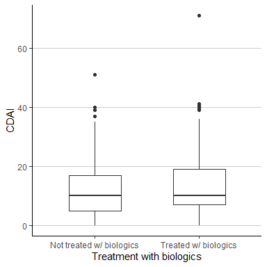
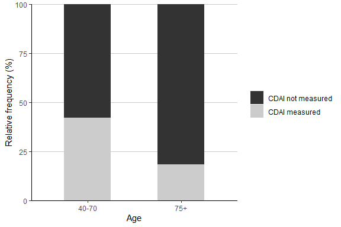
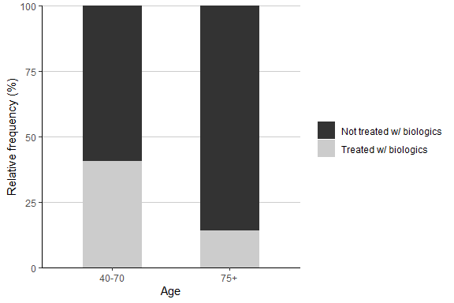

M7 Data Analysis: Nonparametrics
================
Matthew Ragoza
11/10/2021

-   [Treatment of rheumatoid arthritis with
    biologics](#treatment-of-rheumatoid-arthritis-with-biologics)
-   [CDAI measurement and age group](#cdai-measurement-and-age-group)
-   [Treatment with biologics and age
    group](#treatment-with-biologics-and-age-group)

# Treatment of rheumatoid arthritis with biologics

This study involved a sample of patients in two different age groups
with rheumatoid arthritis (RA) at a clinic in Philadelphia. One aspect
of the study was to understand the relationships between the age group,
a measure of disease activity called the Clinical Disease Activity
Indicator (CDAI), and treatment of the disease with biologic medication.

The first research question we will investigate is whether treatment of
arthritis with biologics was associated with disease activity, measured
by CDAI. We can numerically compare measures of center and spread of the
CDAI measurement grouped by treatment with biologics, as seen in Table
1. For those not treated with biologics, the mean of CDAI (12.2) was
higher than the median (10). For those treated with biologics, the mean
(14.0) was also higher than the median (10). This indicates that the
distributions of CDAI were right-skewed. The median and IQR of CDAI were
the same regardless of receiving biologics treatment, but the
differences in the 1st and 3rd quartile imply that the distributions
might be shifted. Upon examining the side-by-side box plots of CDAI seen
in the Figure 1, it appears that CDAI may be shifted slightly higher for
those treated with biologics.

``` r
ra %>%
    drop_na(cdai) %>%
    group_by(Biologics) %>%
    summarise(
        n=n(),
        mean=mean(cdai),
        SD=sd(cdai),
        Q1=quantile(cdai, 0.25),
        Q2=quantile(cdai, 0.50),
        Q3=quantile(cdai, 0.75),
        IQR=quantile(cdai, 0.75)-quantile(cdai, 0.25),
        min=min(cdai),
        max=max(cdai),
        range=max(cdai)-min(cdai)
    ) %>%
    mutate_if(is.numeric, round, digits=1) %>%
    kable() %>%
    kable_styling()
```

<table class="table" style="margin-left: auto; margin-right: auto;">
<thead>
<tr>
<th style="text-align:left;">
Biologics
</th>
<th style="text-align:right;">
n
</th>
<th style="text-align:right;">
mean
</th>
<th style="text-align:right;">
SD
</th>
<th style="text-align:right;">
Q1
</th>
<th style="text-align:right;">
Q2
</th>
<th style="text-align:right;">
Q3
</th>
<th style="text-align:right;">
IQR
</th>
<th style="text-align:right;">
min
</th>
<th style="text-align:right;">
max
</th>
<th style="text-align:right;">
range
</th>
</tr>
</thead>
<tbody>
<tr>
<td style="text-align:left;">
Not treated w/ biologics
</td>
<td style="text-align:right;">
102
</td>
<td style="text-align:right;">
12.2
</td>
<td style="text-align:right;">
10.5
</td>
<td style="text-align:right;">
5
</td>
<td style="text-align:right;">
10
</td>
<td style="text-align:right;">
17
</td>
<td style="text-align:right;">
12
</td>
<td style="text-align:right;">
0
</td>
<td style="text-align:right;">
51
</td>
<td style="text-align:right;">
51
</td>
</tr>
<tr>
<td style="text-align:left;">
Treated w/ biologics
</td>
<td style="text-align:right;">
104
</td>
<td style="text-align:right;">
14.0
</td>
<td style="text-align:right;">
11.6
</td>
<td style="text-align:right;">
7
</td>
<td style="text-align:right;">
10
</td>
<td style="text-align:right;">
19
</td>
<td style="text-align:right;">
12
</td>
<td style="text-align:right;">
0
</td>
<td style="text-align:right;">
71
</td>
<td style="text-align:right;">
71
</td>
</tr>
</tbody>
</table>

**Table 1.** Measures of center and spread for CDAI by treatment with
biologics.

``` r
ra %>%
    drop_na(Biologics) %>%
    ggplot(aes(
        x=Biologics,
        y=cdai,
    )) +
    geom_boxplot(na.rm=TRUE, width=0.5) +
    xlab('Treatment with biologics') +
    ylab('CDAI') +
    theme_classic() +
    theme(
        panel.grid.major.y=element_line(color='grey80'),
    )
```

<!-- -->

**Figure 1.** Side-by-side box plots of CDAI by treatment with
biologics.

We will use a nonparametric statistical test to answer the research
question. The parameter(s) of interest are the population medians of
CDAI for the treatment groups. The null hypothesis is that there is no
difference between the median CDAI for the treatment groups. The
alternative hypothesis is that the median CDAI is greater for those
treated with biologics than those who were not. It seems from the
similar skewness and IQR of the two CDAI distributions that the have
they same shape. In addition, we can assume based on the study design
that we have two independent random samples. Therefore, the conditions
are met to apply a Wilcoxon rank sum test. We will now perform the test
at a significance level of 0.05.

``` r
alpha = 0.05
ra$Biologics2 <- -as.numeric(ra$Biologics) # change level order
wilcox.test(cdai ~ Biologics2, data=ra, alternative='greater')
```

    ## 
    ##  Wilcoxon rank sum test with continuity correction
    ## 
    ## data:  cdai by Biologics2
    ## W = 5777.5, p-value = 0.1342
    ## alternative hypothesis: true location shift is greater than 0

The p-value of 0.134 indicates that we would have a 13.4% chance of
getting a test statistic this high if the null hypothesis were true.
Since we chose a significance level of 5%, the test statistic is not in
the rejection region, so we fail to reject the null hypothesis. We do
not have sufficient evidence to conclude that the population median CDAI
is greater for the group that was treated with biologics than the group
that was not. If we wanted to use a more efficiency statistical test, we
could have used a two sample t test with unequal variance. The only
additional condition for this test is that we have at least 30
individuals in each sample, or that they be normally distributed. The
skewness of the distributions would make it unlikely that they are
normal, but the sample sizes of 102 and 104 are both greater than 30, so
the conditions for the parametric test are satisfied.

# CDAI measurement and age group

The next question we will address is whether there is a difference
between the age groups in the likelihood that CDAI was measured at all.
We can summarize this numerically as a table of the counts and relative
frequencies of CDAI measurement for each age group, seen in Table 2. Out
of the 459 individuals in the 40-70 age range, 193 had CDAI measured
(42.0%). In contrast, only 13 of the 71 individuals in 75+ age group
(18.3%) had CDAI measured. This difference is visually apparent in the
relative frequency bar plot depicted in Figure 2.

``` r
ra %>%
    group_by(Age, CDAI_YN) %>%
    count() %>%
    spread(key=CDAI_YN, value=n) %>%
    adorn_totals(where=c('row', 'col')) %>%
    mutate(
        `% CDAI not measured`=`CDAI not measured`/Total*100,
        `% CDAI measured`=`CDAI measured`/Total*100,
        `% Total`=(`CDAI not measured`+`CDAI measured`)/Total*100
    ) %>%
    mutate_if(is.numeric, round, digits=1) %>%
    kable() %>%
    kable_styling()
```

<table class="table" style="margin-left: auto; margin-right: auto;">
<thead>
<tr>
<th style="text-align:left;">
Age
</th>
<th style="text-align:right;">
CDAI not measured
</th>
<th style="text-align:right;">
CDAI measured
</th>
<th style="text-align:right;">
Total
</th>
<th style="text-align:right;">
% CDAI not measured
</th>
<th style="text-align:right;">
% CDAI measured
</th>
<th style="text-align:right;">
% Total
</th>
</tr>
</thead>
<tbody>
<tr>
<td style="text-align:left;">
40-70
</td>
<td style="text-align:right;">
266
</td>
<td style="text-align:right;">
193
</td>
<td style="text-align:right;">
459
</td>
<td style="text-align:right;">
58.0
</td>
<td style="text-align:right;">
42.0
</td>
<td style="text-align:right;">
100
</td>
</tr>
<tr>
<td style="text-align:left;">
75+
</td>
<td style="text-align:right;">
58
</td>
<td style="text-align:right;">
13
</td>
<td style="text-align:right;">
71
</td>
<td style="text-align:right;">
81.7
</td>
<td style="text-align:right;">
18.3
</td>
<td style="text-align:right;">
100
</td>
</tr>
<tr>
<td style="text-align:left;">
Total
</td>
<td style="text-align:right;">
324
</td>
<td style="text-align:right;">
206
</td>
<td style="text-align:right;">
530
</td>
<td style="text-align:right;">
61.1
</td>
<td style="text-align:right;">
38.9
</td>
<td style="text-align:right;">
100
</td>
</tr>
</tbody>
</table>

**Table 2.** Two-way table of whether CDAI was measured by age group.
The table has been extended with relative frequencies for each age
group.

``` r
ra %>%
    group_by(Age, CDAI_YN) %>%
    summarise(count=n()) %>%
    mutate(freq=100*count/sum(count)) %>%
    ggplot(aes(
        x=Age, 
        y=freq,
        fill=CDAI_YN
    )) +
    geom_bar(position='stack', stat='identity', width=0.5) +
    scale_y_continuous(expand=c(0,0)) +
    xlab('Age') +
    ylab('Relative frequency (%)') +
    labs(fill=NULL) +
    theme_classic() +
    scale_fill_grey() +
    theme(
        panel.grid.major.y=element_line(color='grey80'),
    )
```

<!-- -->

**Figure 2.** Bar plot of relative frequency of CDAI measurement by age
group.

We want to use a nonparametric test to evaluate whether there is an
association between the patients’ age range and whether CDAI was
measured. The null hypothesis is that the frequency of CDAI measurement
is independent of the age range of the patients. The alternative
hypothesis is that the frequency of CDAI measurement is dependent on the
age range of the patients. We can assume that the study used a simple
random sample of patients, so the criteria are satisfied to use Fisher’s
exact test. We will now run the test at a significance level of 0.05.

``` r
alpha = 0.05
m <- matrix(c(266, 58, 193, 13), nrow=2)
fisher.test(m)
```

    ## 
    ##  Fisher's Exact Test for Count Data
    ## 
    ## data:  m
    ## p-value = 0.0001205
    ## alternative hypothesis: true odds ratio is not equal to 1
    ## 95 percent confidence interval:
    ##  0.1511473 0.5914627
    ## sample estimates:
    ## odds ratio 
    ##  0.3095428

The p-value of 0.00012 indicates that we would have a 0.012% chance of
obtaining a table of counts this extreme if the null hypothesis were
true. Since we set the significance level at 5%, we can safely reject
the null hypothesis. We have very strong evidence that the likelihood of
having CDAI measured is dependent on the age range of the patient. The
odds ratio of 0.31 indicates that patients in the 75+ age range had
about 3 times lower odds of having their CDAI measured than patients in
the 40-70 age range. If we wanted to use a parametric hypothesis test
instead, the most appropriate test would be a chi-squared test of
independence. This would necessitate that each cell in the two-way table
have at least 5 expected counts assuming that the variables are
independent. We can quickly test if this is the case by the fact that
the cell with the fewest expected counts would have 206\*71/530 = 27.6
counts, which is greater than 5. Therefore, we could have used the
chi-squared test if we wanted to.

# Treatment with biologics and age group

The final question we will investigate is whether there is a difference
between the age groups in the likelihood of receiving treatment with
biologics. Table 3 shows a numerical summary of the counts and relative
frequency of receiving biologics treatment for each age group. Out of
the 459 patients in the 40-70 age group, 187 were treated with biologics
(40.7%). On the other hand, only 10 out of the 70 patients in the 75+
age group (14.3%) received treatment with biologics. The relative
frequency bar plot in Figure 3 highlights this disparity in biologics
treatment by age group.

``` r
ra %>%
    drop_na(Biologics) %>%
    group_by(Age, Biologics) %>%
    count() %>%
    spread(key=Biologics, value=n) %>%
    adorn_totals(where=c('row', 'col')) %>%
    mutate(
        `% Not treated w/ biologics`=`Not treated w/ biologics`/Total*100,
        `% Treated w/ biologics`=`Treated w/ biologics`/Total*100,
        `% Total`=(`Treated w/ biologics`+`Not treated w/ biologics`)/Total*100
    ) %>%
    mutate_if(is.numeric, round, digits=1) %>%
    kable() %>%
    kable_styling()
```

<table class="table" style="margin-left: auto; margin-right: auto;">
<thead>
<tr>
<th style="text-align:left;">
Age
</th>
<th style="text-align:right;">
Not treated w/ biologics
</th>
<th style="text-align:right;">
Treated w/ biologics
</th>
<th style="text-align:right;">
Total
</th>
<th style="text-align:right;">
% Not treated w/ biologics
</th>
<th style="text-align:right;">
% Treated w/ biologics
</th>
<th style="text-align:right;">
% Total
</th>
</tr>
</thead>
<tbody>
<tr>
<td style="text-align:left;">
40-70
</td>
<td style="text-align:right;">
272
</td>
<td style="text-align:right;">
187
</td>
<td style="text-align:right;">
459
</td>
<td style="text-align:right;">
59.3
</td>
<td style="text-align:right;">
40.7
</td>
<td style="text-align:right;">
100
</td>
</tr>
<tr>
<td style="text-align:left;">
75+
</td>
<td style="text-align:right;">
60
</td>
<td style="text-align:right;">
10
</td>
<td style="text-align:right;">
70
</td>
<td style="text-align:right;">
85.7
</td>
<td style="text-align:right;">
14.3
</td>
<td style="text-align:right;">
100
</td>
</tr>
<tr>
<td style="text-align:left;">
Total
</td>
<td style="text-align:right;">
332
</td>
<td style="text-align:right;">
197
</td>
<td style="text-align:right;">
529
</td>
<td style="text-align:right;">
62.8
</td>
<td style="text-align:right;">
37.2
</td>
<td style="text-align:right;">
100
</td>
</tr>
</tbody>
</table>

**Table 3.** Two-way table of treatment with biologics by age group. The
table has been extended with relative frequencies for each age group.

``` r
ra %>%
    drop_na(Biologics) %>%
    group_by(Age, Biologics) %>%
    summarise(count=n()) %>%
    mutate(freq=100*count/sum(count)) %>%
    ggplot(aes(
        x=Age, 
        y=freq,
        fill=Biologics
    )) +
    geom_bar(position='stack', stat='identity', width=0.5) +
    scale_y_continuous(expand=c(0,0)) +
    xlab('Age') +
    ylab('Relative frequency (%)') +
    labs(fill=NULL) +
    theme_classic() +
    scale_fill_grey() +
    theme(
        panel.grid.major.y=element_line(color='grey80'),
    )
```

<!-- -->

**Figure 3.** Bar plot of relative frequency of treatment with biologics
by age group.

Again, we would like to use a nonparametric test to determine whether
there is an association between the patient’s age range and whether they
received treatment with biologics. The null hypothesis is that the
frequency of treatment with biologics is independent of the age range of
the patients. The alternative hypothesis is that the frequency of
treatment with biologics is dependent on the age range of the patients.
We have already assumed that the patients in the study were a simple
random sample, so the requirements to apply Fisher’s exact test are met.
We will now run the test using a significance level of 0.05.

``` r
alpha = 0.05
m <- matrix(c(272, 60, 187, 10), nrow=2)
fisher.test(m)
```

    ## 
    ##  Fisher's Exact Test for Count Data
    ## 
    ## data:  m
    ## p-value = 8.891e-06
    ## alternative hypothesis: true odds ratio is not equal to 1
    ## 95 percent confidence interval:
    ##  0.1080309 0.4940959
    ## sample estimates:
    ## odds ratio 
    ##   0.242972

The p-value of 8.9e-06 indicates that we would have almost zero chance
of observing a table of counts this drastic if the null hypothesis were
true. We are using a significance level of 5%, so we can confidently
reject the null hypothesis. We have very strong evidence that the
likelihood of receiving treatment with biologics is dependent on the age
range of the patient. The odds ratio of 0.24 implies that patients in
the 75+ age group had about 4 times lower odds of receiving biologics
treatment than those in the 40-70 age range. To check whether a
chi-squared test of independence could have been used, we can check that
there would be at least 5 expected counts in each cell if the variables
were independent. We only have to check this in the cell with the fewest
expected counts, which would have 197\*70/529 = 26.1 counts. This is
greater than 5, so the conditions would have been satisfied for the
chi-squared test.

From the previous two analyses, we now know that patients in the 75+ age
group were less likely to have their CDAI measured and less likely to
receive treatment with biologics. In the first analysis we looked at the
relationship between biologics treatment and CDAI. In that section, we
dropped the missing values of CDAI from the data frame before conducting
the analysis. However, if there were fewer CDAI measurements in the
patients that did not receive biologics treatment, the missing data
could have biased the result. Older patients would probably tend to have
more severe CDAI scores, and they were less likely to be treated with
biologics. Therefore, the missing data would probably shift the
distribution of CDAI upwards for the group that did not receive
biologics, which could potentially reverse the result of the statistical
test if the shift were drastic enough.
