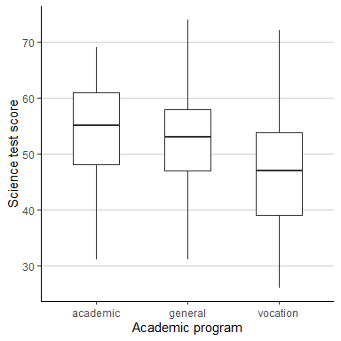
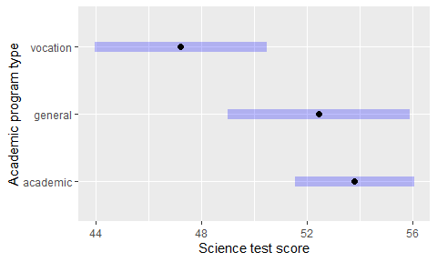
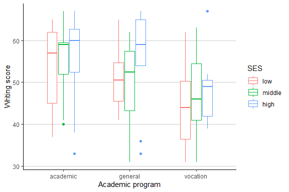

M8 Data Analysis: ANOVA
================
Matthew Ragoza
12/02/2021

-   [Science test scores](#science-test-scores)
-   [Writing test scores](#writing-test-scores)

# Science test scores

This data set consists of the demographics, academic information, and
standardized test scores for a random sample of 200 high school
students. The first research question we would like to answer is whether
the average test scores on the science subsection were different between
students in different types of programs (academic, general, or
vocational).

The science test scores for students in each program type are summarized
using measures of center and spread in Figure 1. Students in academic
programs had the highest mean science test scores of 53.8, compared to
52.4 for students in general programs and 47.2 for students in
vocational programs. The standard deviation of science scores for
students in academic programs was smallest, at 9.1 compared to 9.7 and
10.3 for general and vocational programs. This is possibly a side effect
of the larger sample size of 105 students in academic programs, roughly
double that of the general and vocational programs.

We can visually compare the distributions of science test scores for
students in the three program types using the box plots shown in Figure
1. The center of the science score distribution appears to be highest
for students in academic programs and lowest for those in vocational
programs. There is a very large amount of overlap, however, so we must
turn to a statistical test to objectively determine if there is evidence
of a difference in the means.

``` r
hsb2 %>%
    group_by(program) %>%
    summarise(
        n=n(),
        mean=mean(science),
        SD=sd(science),
        Q1=quantile(science, 0.25),
        Q2=quantile(science, 0.50),
        Q3=quantile(science, 0.75),
        IQR=quantile(science, 0.75)-quantile(science, 0.25),
        min=min(science),
        max=max(science),
        range=max(science)-min(science)
    ) %>%
    mutate_if(is.numeric, round, digits=1) %>%
    kable() %>%
    kable_styling()
```

<table class="table" style="margin-left: auto; margin-right: auto;">
<thead>
<tr>
<th style="text-align:left;">
program
</th>
<th style="text-align:right;">
n
</th>
<th style="text-align:right;">
mean
</th>
<th style="text-align:right;">
SD
</th>
<th style="text-align:right;">
Q1
</th>
<th style="text-align:right;">
Q2
</th>
<th style="text-align:right;">
Q3
</th>
<th style="text-align:right;">
IQR
</th>
<th style="text-align:right;">
min
</th>
<th style="text-align:right;">
max
</th>
<th style="text-align:right;">
range
</th>
</tr>
</thead>
<tbody>
<tr>
<td style="text-align:left;">
academic
</td>
<td style="text-align:right;">
105
</td>
<td style="text-align:right;">
53.8
</td>
<td style="text-align:right;">
9.1
</td>
<td style="text-align:right;">
48
</td>
<td style="text-align:right;">
55
</td>
<td style="text-align:right;">
61.0
</td>
<td style="text-align:right;">
13.0
</td>
<td style="text-align:right;">
31
</td>
<td style="text-align:right;">
69
</td>
<td style="text-align:right;">
38
</td>
</tr>
<tr>
<td style="text-align:left;">
general
</td>
<td style="text-align:right;">
45
</td>
<td style="text-align:right;">
52.4
</td>
<td style="text-align:right;">
9.7
</td>
<td style="text-align:right;">
47
</td>
<td style="text-align:right;">
53
</td>
<td style="text-align:right;">
58.0
</td>
<td style="text-align:right;">
11.0
</td>
<td style="text-align:right;">
31
</td>
<td style="text-align:right;">
74
</td>
<td style="text-align:right;">
43
</td>
</tr>
<tr>
<td style="text-align:left;">
vocation
</td>
<td style="text-align:right;">
50
</td>
<td style="text-align:right;">
47.2
</td>
<td style="text-align:right;">
10.3
</td>
<td style="text-align:right;">
39
</td>
<td style="text-align:right;">
47
</td>
<td style="text-align:right;">
53.8
</td>
<td style="text-align:right;">
14.8
</td>
<td style="text-align:right;">
26
</td>
<td style="text-align:right;">
72
</td>
<td style="text-align:right;">
46
</td>
</tr>
</tbody>
</table>

**Table 1.** Measures of center and spread for science test scores by
academic program.

``` r
hsb2 %>%
    ggplot(aes(
        x=program,
        y=science,
    )) +
    geom_boxplot(na.rm=TRUE, width=0.5) +
    xlab('Academic program') +
    ylab('Science test score') +
    theme_classic() +
    theme(
        panel.grid.major.y=element_line(color='grey80'),
    )
```

<!-- -->

**Figure 1.** Side-by-side box plots of science test scores by academic
program.

We would like to test whether there is any difference between the means
of the the science test scores between students in different academic
programs. Since we are interested in the means of a quantitative
variable with respect to a categorical variables with three different
groups, the most appropriate test is one-way analysis of variance
(ANOVA). Our null hypothesis is that there is no difference in mean
science test scores between students in the different academic programs.
The alternative hypothesis is that the mean science test score for at
least one academic program type is different from the others. Before
running ANOVA, we need to check the conditions of the test. The students
in the different academic programs are each independent simple random
samples, and there are at least 30 students in each group. We will
assume that the variance of the science test scores is the same across
program types. Therefore, the conditions are satisfied and we can now
perform one-way ANOVA using a significance level of 0.05.

``` r
alpha = 0.05

model1.formula <- lm(science ~ program, data=hsb2)
Anova(model1.formula)
```

    ## Anova Table (Type II tests)
    ## 
    ## Response: science
    ##           Sum Sq  Df F value    Pr(>F)    
    ## program     1487   2   8.128 0.0004057 ***
    ## Residuals  18021 197                      
    ## ---
    ## Signif. codes:  0 '***' 0.001 '**' 0.01 '*' 0.05 '.' 0.1 ' ' 1

The p-value of 0.0004 indicates that we would have a 0.04% chance of
obtaining a test statistic this large if the null hypothesis were true.
Since we set our significance level to 5%, we can reject the null
hypothesis. This implies that we have strong evidence to support that
students in at least one academic program type have different mean
science test scores than in the other program types.

However, the one-way ANOVA test does not enable us to determine which
program type(s) have significantly different means. To answer this
follow-up question, we must perform post-hoc analysis comparing the mean
science test scores of each pair of academic program types using
two-sample Student’s t-tests. One problem with this approach is that
multiple testing increases the type I error rate, so we will apply the
Bonferroni correction to maintain the overall type I error rate at our
chosen significance level of 5%.

We will now run two-sample t-tests using each pair of academic program
types to determine which of them have different mean science test
scores. For each pair of program types, the null hypothesis is that the
mean science test scores are the same, while the alternative hypothesis
is that they are different. We know the conditions are met to run the
two-sample t-tests because they are the same conditions required for
running ANOVA. We can proceed to run the post-hoc analysis using an
overall significance level of 0.05, with the Bonferroni correction.

``` r
# post hoc analysis
model1.emm <- emmeans(
    model1.formula,
    pairwise ~ program,
    adjust="bonferroni"
)
model1.emm
```

    ## $emmeans
    ##  program  emmean    SE  df lower.CL upper.CL
    ##  academic   53.8 0.933 197     52.0     55.6
    ##  general    52.4 1.426 197     49.6     55.3
    ##  vocation   47.2 1.353 197     44.6     49.9
    ## 
    ## Confidence level used: 0.95 
    ## 
    ## $contrasts
    ##  contrast            estimate   SE  df t.ratio p.value
    ##  academic - general      1.36 1.70 197   0.795  1.0000
    ##  academic - vocation     6.58 1.64 197   4.004  0.0003
    ##  general - vocation      5.22 1.97 197   2.658  0.0255
    ## 
    ## P value adjustment: bonferroni method for 3 tests

From the post-hoc analysis, we obtained three different p-values, one
for each pair of different academic program types. The p-value for the
(academic, general) pair was not below the significance level of 5%, so
we do not have evidence of a difference in mean science test scores
between academic and general programs. However, the p-values for the
(academic, vocation) pair and the (general, vocation) pair indicate that
we would have a 0.03% and 2.55% chance, respectively, of obtaining test
statistics this extreme if the null hypothesis were true. These are
below the significance level, so we can reject two out of the three
post-hoc null hypotheses. We have evidence to believe that there is a
difference in mean science test scores between academic and vocational
programs and between general and vocational programs, but not between
academic and general programs.

``` r
# simultaneous confidence intervals
model1.ci <- confint(
    model1.emm, adjust='bonferroni'
)$emmeans
plot(model1.ci, ylab='Academic program type', xlab='Science test score')
```

<!-- -->

**Figure 2.** 98.3% confidence intervals for science test scores by
academic program type.

To further investigate the difference in science test scores between
programs, we can construct Bonferroni-corrected simultaneous confidence
intervals. Since we are using a significance level of 5% and we ran
three post-hoc tests, we construct 98.3% confidence intervals for each
group mean, which are shown in Figure 2. We interpret these confidence
intervals by the fact that in repeated samples, 98.3% of the confidence
intervals would contain the true population mean. Notice that the mean
science test score for vocational programs is not contained within the
confidence interval of either the general or academic programs. In
contrast, the mean for general programs is contained within the
confidence interval for academic programs and vice versa. This supports
the conclusion of the post-hoc analysis that the vocational program mean
science test score was significantly different than the other two
program types, which did not have significantly different mean science
test scores from each other.

# Writing test scores

The second research question that we would like to investigate is
whether there is a difference in average writing test scores for
students in different academic program types and who have different
socioeconomic status (SES). If there are any differences, we would like
to characterize them as best as we can. We can begin with the numerical
summary shown in Table 2, which displays measures of center and spread
for writing test scores split by academic program type and SES. The
group with the highest mean writing score of 57.3 was students of high
SES in academic programs, while the group with the lowest mean writing
score of 44.8 was students of low SES in vocational programs. The
standard deviations for the groups ranged from 6.5 to 12.4. There are
nine different group combinations in total, so it is difficult to grasp
the important relationships in the data just from a numerical summary.

We can gain a deeper understanding of the data through visualizing it as
grouped side-by-side box plots in Figure 3. This makes a few general
trends more evident, such as an increase in mean writing test score with
increasing SES. This trend appears to hold across each of the different
academic program types, though the relationship might not be the same in
each group. This points to the possibility of an interaction between
academic program type and SES for the mean writing test score. In
addition to the trend with SES, the mean writing test score in
vocational program types looks to be lower than the other program types,
regardless of SES. We can investigate these relationships objectively
through hypothesis testing.

``` r
hsb2 %>%
    group_by(program, SES) %>%
    summarise(
        n=n(),
        mean=mean(write),
        SD=sd(write),
        Q1=quantile(write, 0.25),
        Q2=quantile(write, 0.50),
        Q3=quantile(write, 0.75),
        IQR=quantile(write, 0.75)-quantile(write, 0.25),
        min=min(write),
        max=max(write),
        range=max(write)-min(write)
    ) %>%
    mutate_if(is.numeric, round, digits=1) %>%
    kable() %>%
    kable_styling()
```

<table class="table" style="margin-left: auto; margin-right: auto;">
<thead>
<tr>
<th style="text-align:left;">
program
</th>
<th style="text-align:left;">
SES
</th>
<th style="text-align:right;">
n
</th>
<th style="text-align:right;">
mean
</th>
<th style="text-align:right;">
SD
</th>
<th style="text-align:right;">
Q1
</th>
<th style="text-align:right;">
Q2
</th>
<th style="text-align:right;">
Q3
</th>
<th style="text-align:right;">
IQR
</th>
<th style="text-align:right;">
min
</th>
<th style="text-align:right;">
max
</th>
<th style="text-align:right;">
range
</th>
</tr>
</thead>
<tbody>
<tr>
<td style="text-align:left;">
academic
</td>
<td style="text-align:left;">
low
</td>
<td style="text-align:right;">
19
</td>
<td style="text-align:right;">
53.6
</td>
<td style="text-align:right;">
9.7
</td>
<td style="text-align:right;">
45.0
</td>
<td style="text-align:right;">
57.0
</td>
<td style="text-align:right;">
62.0
</td>
<td style="text-align:right;">
17.0
</td>
<td style="text-align:right;">
37
</td>
<td style="text-align:right;">
65
</td>
<td style="text-align:right;">
28
</td>
</tr>
<tr>
<td style="text-align:left;">
academic
</td>
<td style="text-align:left;">
middle
</td>
<td style="text-align:right;">
44
</td>
<td style="text-align:right;">
56.4
</td>
<td style="text-align:right;">
6.5
</td>
<td style="text-align:right;">
52.0
</td>
<td style="text-align:right;">
59.0
</td>
<td style="text-align:right;">
59.5
</td>
<td style="text-align:right;">
7.5
</td>
<td style="text-align:right;">
40
</td>
<td style="text-align:right;">
67
</td>
<td style="text-align:right;">
27
</td>
</tr>
<tr>
<td style="text-align:left;">
academic
</td>
<td style="text-align:left;">
high
</td>
<td style="text-align:right;">
42
</td>
<td style="text-align:right;">
57.3
</td>
<td style="text-align:right;">
8.3
</td>
<td style="text-align:right;">
52.5
</td>
<td style="text-align:right;">
60.0
</td>
<td style="text-align:right;">
62.8
</td>
<td style="text-align:right;">
10.2
</td>
<td style="text-align:right;">
33
</td>
<td style="text-align:right;">
67
</td>
<td style="text-align:right;">
34
</td>
</tr>
<tr>
<td style="text-align:left;">
general
</td>
<td style="text-align:left;">
low
</td>
<td style="text-align:right;">
16
</td>
<td style="text-align:right;">
51.4
</td>
<td style="text-align:right;">
7.0
</td>
<td style="text-align:right;">
45.5
</td>
<td style="text-align:right;">
50.5
</td>
<td style="text-align:right;">
54.8
</td>
<td style="text-align:right;">
9.2
</td>
<td style="text-align:right;">
41
</td>
<td style="text-align:right;">
65
</td>
<td style="text-align:right;">
24
</td>
</tr>
<tr>
<td style="text-align:left;">
general
</td>
<td style="text-align:left;">
middle
</td>
<td style="text-align:right;">
20
</td>
<td style="text-align:right;">
49.6
</td>
<td style="text-align:right;">
9.6
</td>
<td style="text-align:right;">
43.2
</td>
<td style="text-align:right;">
52.5
</td>
<td style="text-align:right;">
57.5
</td>
<td style="text-align:right;">
14.2
</td>
<td style="text-align:right;">
31
</td>
<td style="text-align:right;">
62
</td>
<td style="text-align:right;">
31
</td>
</tr>
<tr>
<td style="text-align:left;">
general
</td>
<td style="text-align:left;">
high
</td>
<td style="text-align:right;">
9
</td>
<td style="text-align:right;">
55.0
</td>
<td style="text-align:right;">
12.4
</td>
<td style="text-align:right;">
54.0
</td>
<td style="text-align:right;">
59.0
</td>
<td style="text-align:right;">
65.0
</td>
<td style="text-align:right;">
11.0
</td>
<td style="text-align:right;">
33
</td>
<td style="text-align:right;">
67
</td>
<td style="text-align:right;">
34
</td>
</tr>
<tr>
<td style="text-align:left;">
vocation
</td>
<td style="text-align:left;">
low
</td>
<td style="text-align:right;">
12
</td>
<td style="text-align:right;">
44.8
</td>
<td style="text-align:right;">
10.1
</td>
<td style="text-align:right;">
36.5
</td>
<td style="text-align:right;">
44.0
</td>
<td style="text-align:right;">
50.2
</td>
<td style="text-align:right;">
13.8
</td>
<td style="text-align:right;">
31
</td>
<td style="text-align:right;">
62
</td>
<td style="text-align:right;">
31
</td>
</tr>
<tr>
<td style="text-align:left;">
vocation
</td>
<td style="text-align:left;">
middle
</td>
<td style="text-align:right;">
31
</td>
<td style="text-align:right;">
47.1
</td>
<td style="text-align:right;">
9.2
</td>
<td style="text-align:right;">
41.0
</td>
<td style="text-align:right;">
46.0
</td>
<td style="text-align:right;">
54.5
</td>
<td style="text-align:right;">
13.5
</td>
<td style="text-align:right;">
31
</td>
<td style="text-align:right;">
63
</td>
<td style="text-align:right;">
32
</td>
</tr>
<tr>
<td style="text-align:left;">
vocation
</td>
<td style="text-align:left;">
high
</td>
<td style="text-align:right;">
7
</td>
<td style="text-align:right;">
48.6
</td>
<td style="text-align:right;">
9.5
</td>
<td style="text-align:right;">
42.0
</td>
<td style="text-align:right;">
49.0
</td>
<td style="text-align:right;">
50.5
</td>
<td style="text-align:right;">
8.5
</td>
<td style="text-align:right;">
39
</td>
<td style="text-align:right;">
67
</td>
<td style="text-align:right;">
28
</td>
</tr>
</tbody>
</table>

**Table 2.** Measures of center and spread for writing test scores by
academic program and SES.

``` r
hsb2 %>%
    ggplot(aes(
        x=prog,
        y=write,
        color=SES,
    )) +
    geom_boxplot(na.rm=TRUE, width=0.5) +
    xlab('Academic program') +
    ylab('Writing score') +
    theme_classic() +
    theme(
        panel.grid.major.y=element_line(color='grey80'),
    )
```

<!-- -->

**Figure 3.** Side-by-side box plots of writing test scores by academic
program and SES.

We would now like to answer two related questions about the relationship
of mean writing test score with academic program type and SES. We would
like to know if there are any differences in mean writing score for
different academic programs and SES levels, but first and foremost we
need to know if there is an interaction between these two categorical
variables on the mean writing score. Both of these questions can be
answered using two-way analysis of variance (ANOVA) by considering the
main effects and interaction effect of the variables.

To test for an interaction, our null hypothesis is that there is no
effect from the interaction term between academic program and SES on the
mean writing test score. The alternative hypothesis is that there is an
effect from the interaction term on the mean writing test score. We
should now check the conditions of the test. The students in each
subgroup of program type and SES are independent simple random samples.
There are not at least 30 students in each subgroup, but we will assume
that the population of writing test scores is normally distributed. We
will also assume that the writing test scores for each subgroup have
equal variance. We have satisfied the test conditions, so we will now
run two-way ANOVA using a significance level of 0.05.

``` r
alpha = 0.05
model1.formula <- lm(write ~ program*SES, data=hsb2)
Anova(model1.formula)
```

    ## Anova Table (Type II tests)
    ## 
    ## Response: write
    ##              Sum Sq  Df F value    Pr(>F)    
    ## program      2591.2   2 17.3460 1.196e-07 ***
    ## SES           274.2   2  1.8357    0.1623    
    ## program:SES   162.8   4  0.5450    0.7029    
    ## Residuals   14266.1 191                      
    ## ---
    ## Signif. codes:  0 '***' 0.001 '**' 0.01 '*' 0.05 '.' 0.1 ' ' 1

The two-way ANOVA table has p-values for both the main effects and the
interaction effect of program type and SES on writing test scores. The
p-value for the interaction effect indicates that we would have a 70.3%
chance of getting a test statistic this large if the null hypothesis
were true. Since we selected a significance level of 5%, we do not
reject the null hypothesis. Thus we do not have evidence of an
interaction effect between academic program type and SES on mean writing
test scores.

Since there is no interaction effect, we can proceed to consider the
main effects of the two group variables on the outcome separately,
beginning with the main effect of academic program type. The p-value for
the main effect of program type on writing test scores indicates that we
would have a miniscule probability of reaching a test statistic this
large if the null hypothesis were true. At a 5% significance level, we
can soundly reject the null hypothesis. We have very strong evidence
that there is a difference in mean writing test scores between students
in different academic program types.

Moving on to the main effect of SES on writing test scores, the p-value
implies that we would have a 16.2% chance of seeing a test statistic
this large if the null hypothesis were true. At our 5% significance
level, we do not reject the null hypothesis. Therefore, we do not have
evidence that there is a difference in mean writing test scores between
students from different SES backgrounds.

We have discovered a significant main effect of program type on mean
writing test scores, but no main effect from SES and no interaction
effect between program and SES. We will now investigate the main effect
of program type on writing scores further through post-hoc analysis. The
goal of this analysis will be to determine which pairs of the academic
program types have different mean writing test scores. We can perform
two-sample Student’s t-tests on mean writing scores for each pair of
program types. We will again apply the Bonferroni correction to maintain
the overall typer I error rate at our 5% significance level.

We will now run two-sample t-tests using each pair of academic program
types to determine which of them have different mean writing test
scores. For each post-hoc test, the null hypothesis is that the mean
writing test scores are the same, while the alternative hypothesis is
that they are different.The conditions for the two-sample t tests are
met by virtue of the fact that they are the same conditions that are
required for ANOVA, which we have already satisfied. We will now run the
post-hoc analysis using an overall Bonferroni-correct significance level
of 0.05.

``` r
# post hoc analysis
model1.emm <- emmeans(
    model1.formula,
    pairwise ~ program,
    adjust="bonferroni"
)
```

    ## NOTE: Results may be misleading due to involvement in interactions

``` r
model1.emm
```

    ## $emmeans
    ##  program  emmean    SE  df lower.CL upper.CL
    ##  academic   55.8 0.907 191     54.0     57.6
    ##  general    52.0 1.362 191     49.3     54.7
    ##  vocation   46.8 1.465 191     43.9     49.7
    ## 
    ## Results are averaged over the levels of: SES 
    ## Confidence level used: 0.95 
    ## 
    ## $contrasts
    ##  contrast            estimate   SE  df t.ratio p.value
    ##  academic - general      3.76 1.64 191   2.300  0.0677
    ##  academic - vocation     8.96 1.72 191   5.201  <.0001
    ##  general - vocation      5.20 2.00 191   2.598  0.0304
    ## 
    ## Results are averaged over the levels of: SES 
    ## P value adjustment: bonferroni method for 3 tests

The post-hoc tests have given us a p-value for the difference in mean
writing test scores for each pair of academic program types. The p-value
for the (academic, general) pair was not below the significance level of
5%, so we do not have evidence of a difference in mean writing test
scores between academic and general programs. The p-value for the
(academic, vocation) pair implies that we have less than 0.01% chance of
obtaining a test statistic this extreme under the null hypothesis.
Furthermore, the p-value for the (general, vocation) means that we would
have a 3.04% chance of getting this extreme a result under the null
hypothesis. These second two p-values are below the significance level,
so we can reject two out of the three post-hoc null hypotheses. In
conclusion, we have evidence that there is a difference in mean writing
test scores between academic and vocational programs and between general
and vocational programs, but not between academic and general programs.

``` r
# simultaneous confidence intervals
model1.ci <- confint(
    model1.emm, adjust='bonferroni'
)$emmeans
plot(model1.ci, ylab='Academic program type', xlab='Writing test score')
```

<!-- -->

**Figure 4.** 98.3% confidence intervals for writing test scores by
academic program type.

Here we have constructed Bonferroni-corrected simultaneous confidence
intervals for mean writing score by academic program type. We use 98.3%
confidence intervals for each group mean, which are shown in Figure 3,
to account for the number of post-hoc tests that we ran. In repeated
samples, 98.3% of the confidence intervals would contain the true
population mean of writing test scores. Somewhat surprisingly, none of
the group mean writing test scores are within the confidence intervals
of any other group means. This is counter to the result of the post-hoc
analysis, which implied that the mean writing test scores for academic
and general program types might be the same. The mean writing score for
the vocational programs is not contained within the confidence intervals
for the other two programs, which is a result that is in agreement with
the post-hoc analysis.
