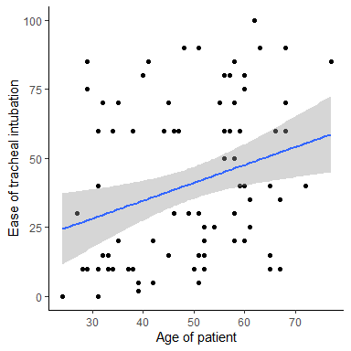

M9 Data Analysis: Linear Regression
================
Matthew Ragoza
12/9/2021

-   [Tracheal Intubation and Age](#tracheal-intubation-and-age)

# Tracheal Intubation and Age

The research question we would like to answer is whether there is a
linear relationship between the age of the patient and the ease of
intubation, where a higher score indicates a more difficult intubation
procedure. Numerical summaries of each variable using measures of center
and spread can be seen in Table 1. The age range of the sample is 20 to
77, with a mean of 49.4 and standard deviation of 13.1 Since the median
of 51 is slightly higher than the mean, the age distribution is slightly
left-skewed. The ease of intubation for this sample ranged from 0 to 100
with a mean of 40.8 and standard deviation of 28.5. The intubation score
distribution was more right-skewed, since the median of 37.5 was less
than the mean. We can jointly compare the distributions of age and ease
of intubation using the scatter plot shown in Figure 1. There appears to
be a slight positive correlation between the ease of intubation and the
age of the patient based on the joint distribution of the points in the
scatter plot.

``` r
lar %>%
    select(c('age', 'ease')) %>%
    melt(value.name='value') %>%
    drop_na(value) %>%
    group_by(variable) %>%
    summarise(
        n=n(),
        mean=mean(value),
        SD=sd(value),
        Q1=quantile(value, 0.25),
        Q2=quantile(value, 0.50),
        Q3=quantile(value, 0.75),
        IQR=quantile(value, 0.75)-quantile(value, 0.25),
        min=min(value),
        max=max(value),
        range=max(value)-min(value)
    ) %>%
    mutate_if(is.numeric, round, digits=1) %>%
    kable() %>%
    kable_styling()
```

<table class="table" style="margin-left: auto; margin-right: auto;">
<thead>
<tr>
<th style="text-align:left;">
variable
</th>
<th style="text-align:right;">
n
</th>
<th style="text-align:right;">
mean
</th>
<th style="text-align:right;">
SD
</th>
<th style="text-align:right;">
Q1
</th>
<th style="text-align:right;">
Q2
</th>
<th style="text-align:right;">
Q3
</th>
<th style="text-align:right;">
IQR
</th>
<th style="text-align:right;">
min
</th>
<th style="text-align:right;">
max
</th>
<th style="text-align:right;">
range
</th>
</tr>
</thead>
<tbody>
<tr>
<td style="text-align:left;">
age
</td>
<td style="text-align:right;">
99
</td>
<td style="text-align:right;">
49.4
</td>
<td style="text-align:right;">
13.1
</td>
<td style="text-align:right;">
38
</td>
<td style="text-align:right;">
51.0
</td>
<td style="text-align:right;">
59
</td>
<td style="text-align:right;">
21
</td>
<td style="text-align:right;">
20
</td>
<td style="text-align:right;">
77
</td>
<td style="text-align:right;">
57
</td>
</tr>
<tr>
<td style="text-align:left;">
ease
</td>
<td style="text-align:right;">
88
</td>
<td style="text-align:right;">
40.8
</td>
<td style="text-align:right;">
28.5
</td>
<td style="text-align:right;">
15
</td>
<td style="text-align:right;">
37.5
</td>
<td style="text-align:right;">
60
</td>
<td style="text-align:right;">
45
</td>
<td style="text-align:right;">
0
</td>
<td style="text-align:right;">
100
</td>
<td style="text-align:right;">
100
</td>
</tr>
</tbody>
</table>

**Table 1.** Measures of center and spread for age and ease of tracheal
intubation.

``` r
lar %>%
    drop_na(ease) %>%
    ggplot(aes(
        x=age,
        y=ease,
    )) +
    geom_point() +
    geom_smooth(method='lm') +
    xlab('Age of patient') +
    ylab('Ease of tracheal intubation') +
    theme_classic()
```

<!-- -->

**Figure 1.** Scatter plot of ease of tracheal intubation and age along
with linear regression model and confidence interval.

We can statistically test the relationship between the variables using
linear regression. We must first check whether the assumptions of linear
regression are satisified. We can assume based on the study design that
the values of the outcome variable, the ease of tracheal intubation, are
independent. We will also surmise based on visual assessment of the
scatter plot in Figure 1 that there is a linear relationship between the
expected ease of intubation and the age of the patient, and also that
the variance of the ease of intubation is constant with respect to the
age of the patient. Finally, we will also assume that the conditional
distribution of the ease of intubation given age is normal. Thus the
requirements for fitting a linear regression model are met, so we will
now fit the model.

``` r
alpha = 0.05

model <- lm(ease ~ age, data=lar)
summary(model)
```

    ## 
    ## Call:
    ## lm(formula = ease ~ age, data = lar)
    ## 
    ## Residuals:
    ##    Min     1Q Median     3Q    Max 
    ## -42.19 -22.54 -10.89  24.13  57.43 
    ## 
    ## Coefficients:
    ##             Estimate Std. Error t value Pr(>|t|)   
    ## (Intercept)   8.7783    11.6343   0.755  0.45260   
    ## age           0.6479     0.2281   2.840  0.00562 **
    ## ---
    ## Signif. codes:  0 '***' 0.001 '**' 0.01 '*' 0.05 '.' 0.1 ' ' 1
    ## 
    ## Residual standard error: 27.45 on 86 degrees of freedom
    ##   (11 observations deleted due to missingness)
    ## Multiple R-squared:  0.08576,    Adjusted R-squared:  0.07513 
    ## F-statistic: 8.067 on 1 and 86 DF,  p-value: 0.005625

``` r
confint(model, 'age', level=0.95)
```

    ##         2.5 %   97.5 %
    ## age 0.1944381 1.101376

The estimated equation for the linear regression model is as follows:

*e**a**s**e* = 8.78 + 0.648 × *a**g**e*

The intercept coefficient of 8.78 indicates that the expected ease of
intubation for a newborn baby (with age 0) would be 8.78. The age
coefficient of 0.648 indicates that there is an increase in the ease of
intubation score of 0.648 for each additional year in the age of the
patient. We are 95% confident that the true change in ease of intubation
for each additional year in age is between 0.194 and 1.101.

We would like to test whether the fit model describes a significant
linear dependence between the ease of intubation and the age of the
patient. The null hypothesis is that there is no change in the expected
value of ease of intubation for a unit change in the age of the patient.
The alternative hypothesis is that there is a non-zero change in the
expected value of ease of intubation for a unit change in the age of the
patient. We will test these hypotheses at a significance level of 0.05.

The t statistic for the age coefficient in the linear model is 2.84.
This implies that the slope is 2.84 standard errors from the null
hypothesis value of 0. The p-value indicates that we would have a 0.56%
chance of observing a slope this extreme if the null hypothesis were
true. Using a significance level of 5%, we can reject the null
hypothesis. We have moderate evidence that there is a weak but non-zero
linear relationship between the ease of intubation and the age of the
patient. The coefficient of determination states that 8.58% of the total
variation in the ease of intubation is explained by the patient’s age.

``` r
age = 40
ease = 8.78 + 0.648 * age
ease
```

    ## [1] 34.7

We can use the estimated linear model to predict the ease of intubation
for a 40 year old patient by substituting the predictor value of 40 into
the equation above. The age of the patient is within the range of the
sample data that was used to fit the model, so this prediction is not
considered extrapolation. In addition, we have verified with a
hypothesis test that the data is explained by a significant linear
relationship. Therefore, it is valid to use the linear model to make
predictions for patients of age 40. The outcome value of 34.7 suggests
that a 40 year old patient has an expected ease of intubation of 34.7.

In conclusion, we have discovered evidence of a significant but weak
correlation between the ease of intubation procedures and the age of the
patient. A newborn patient has an expected ease of intubation of 8.78,
while each additional year in age increases their expected ease of
intubation by 0.648. Furthermore, 8.58% of the total variation in ease
of intubation is explained by the patient’s age.
